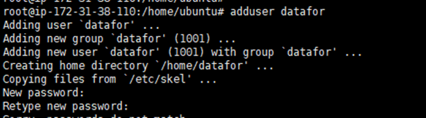
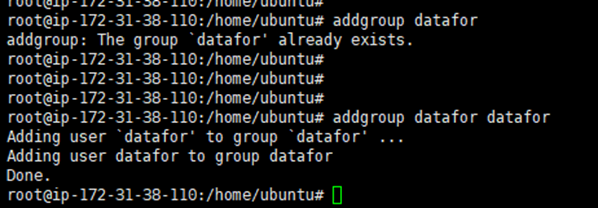
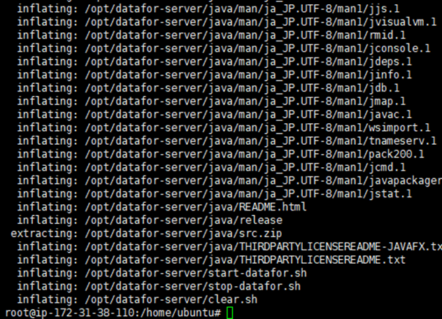
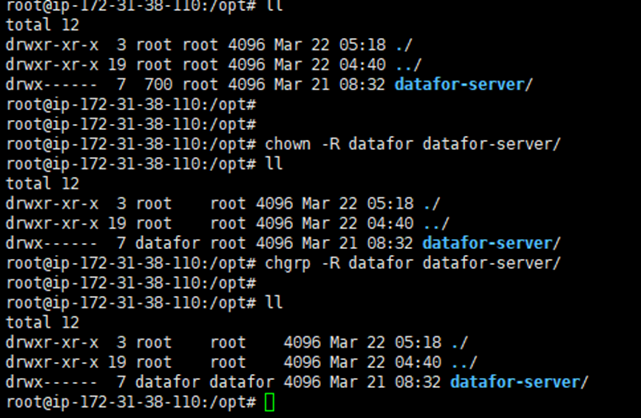
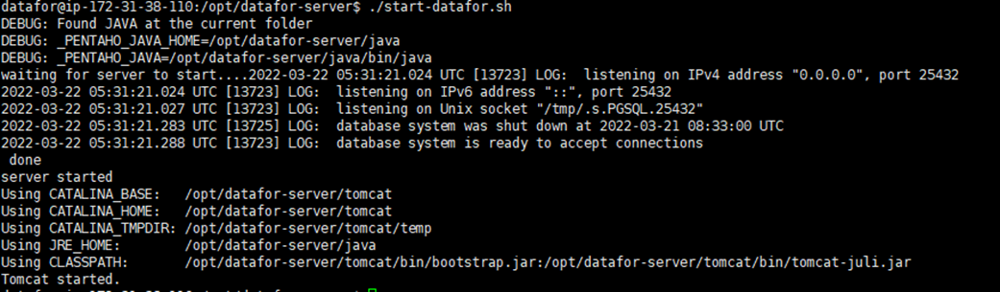
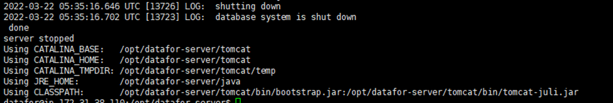
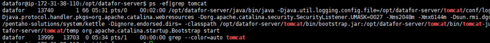

# Datafor Installation (Ubuntu)
## Installation Steps

**Step 1. Switch to the root user**

```
sudo su  
```

<div align="left"></div>

**Step 2. Create the "datafor" user, and set the user password to "datafor" as well.**

```
adduser datafor
```

<div align="left"></div>

**Step 3. Create a user group and add the "datafor" user to the "datafor" user group.**

```
addgroup datafor
addgroup datafor datafor
```

<div align="left"></div>

**Step 4. Navigate to the directory where the installation package is located and unzip the package to the /opt path.**

```
unzip -o datafor-server_202203210834.zip -d /opt/
```

<div align="left"></div>

**Step 5. After the extraction is complete, go to the /opt/ directory and modify permissions.**

```
cd /opt/
chmod -R 700 datafor-server
chown -R datafor datafor-server
chgrp -R datafor datafor-server
```

<div align="left"></div>

**Installation Completed**

Start or stop the service, refer to daily startup procedures.

## Startup

**For daily startup and shutdown, please perform the operations using the "datafor" user.**

```
su datafor
cd /opt/datafor-server/
```

**Start the service**

```
./start-datafor.sh
```

<div align="left"></div>

**Stop the service**

```
./stop-datafor.sh
```

<div align="left"></div>

**Check the status of the service startup and shutdown**

```
ps -ef|grep tomcat
```

<div align="left"></div>

**If the command outputs as above, it indicates that the service is in a running state.**

## Login

URL:  `http://localhost:28080/`

username  /  password

- `admin` / `password`
- `demo` / `demo`

## Update the System

Place the update package `datafor-upload.jar` in the `datafor-server\update` folder and restart the system.