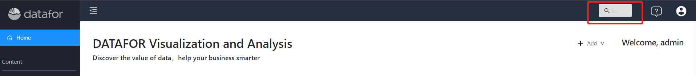
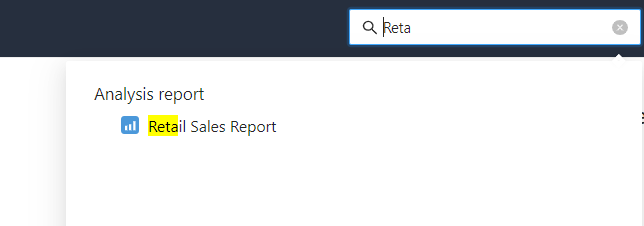

# Global search

When there are more and more contents in the system, search becomes an essential function. DATAFOR provides a global search function, through which you can easily find what you need.

The global search input box is located on the title bar of the console.

Click the input box, and the input box will be automatically widened to facilitate input.

Enter "keyword" in the input box and press the "Enter key", a search result box will pop up automatically below the input box.

The search results are divided into four groups:

- Folder
- Analysis report
- Analysis model
- Other

In the search result list, click the searched item, and the corresponding content will be opened in the console.

Click the search input box again, the result list of the previous search will reopen, and you can select the result item again.

To clear the content of the last search, click the X in the input box, or the search text in the input box.