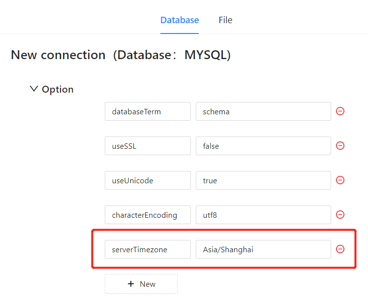

# JDBC Timezone Setting

When using JDBC to connect to a database in Datafor, timezone issues can lead to inconsistencies and confusion with time data. To resolve this, you can ensure the timezone is set correctly and displayed consistently in Datafor by following these steps.

### 1. Why Set JDBC Timezone

In applications spanning multiple time zones, incorrect timezone settings can lead to confusion with time data. For instance, timestamp data may differ during storage and retrieval. Setting the JDBC timezone ensures consistency between the client and the database server.

### 2. Configuring Datafor Data Source Timezone

Add a new parameter in the "options" section of the database connection configuration to set the timezone parameter and value.

### 3. Verify Timezone Setting

After configuring the timezone setting, ensure that the time data is displayed correctly:

1. Create time-related visualizations in Datafor.
2. Confirm that the time data matches expectations.

### Conclusion

By properly setting and adjusting the timezone, you can ensure the consistency and accuracy of time data in Datafor.
