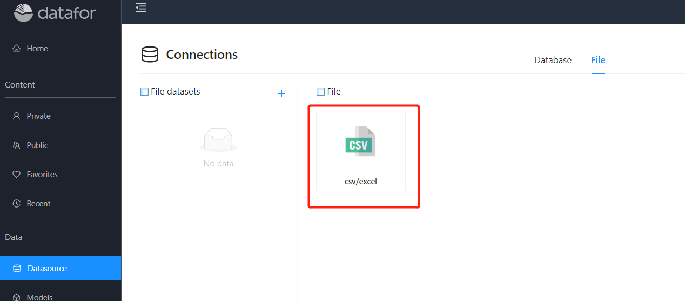
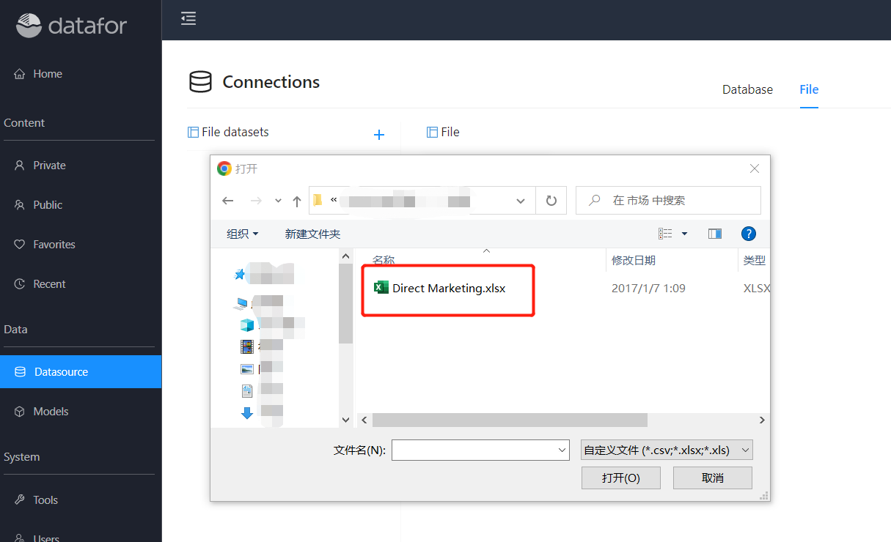
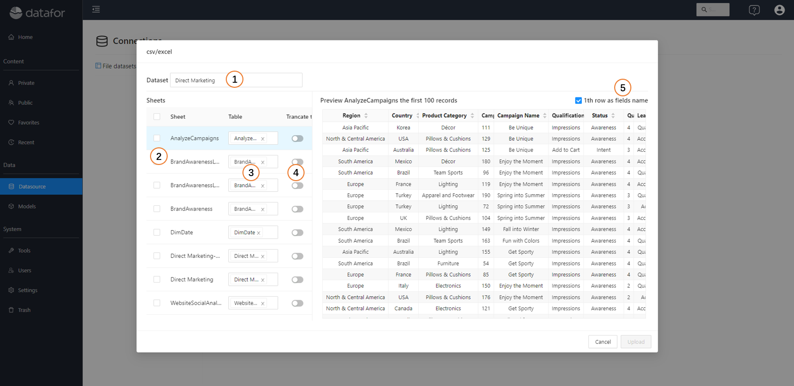
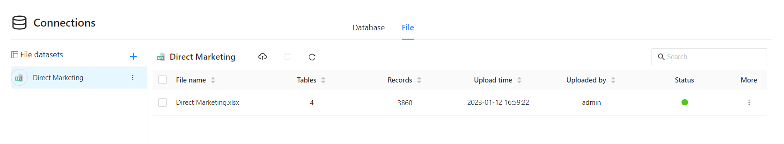
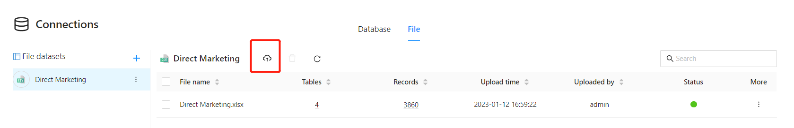
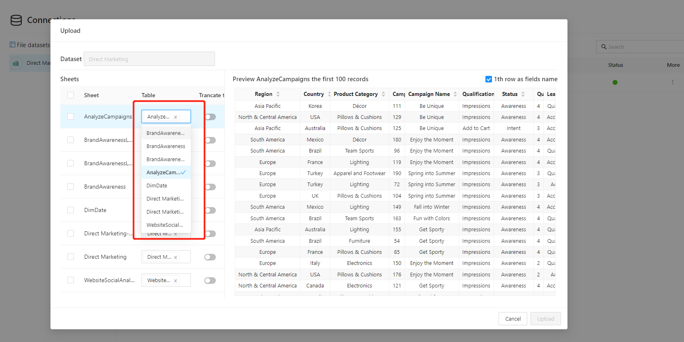
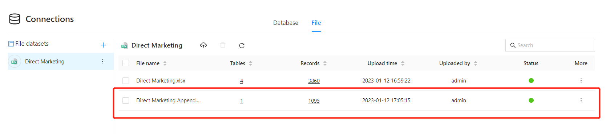
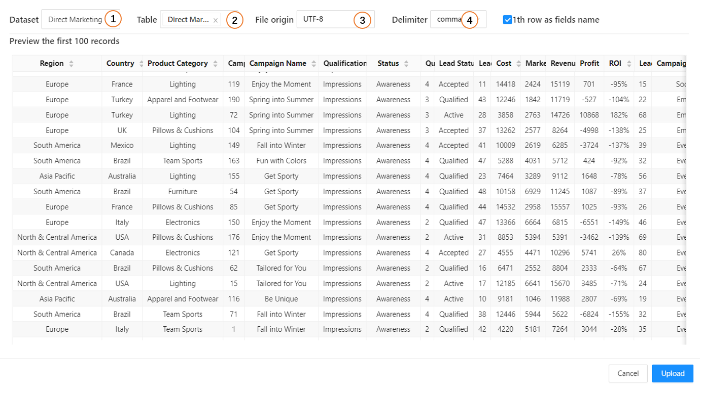

# File dataset

Microsoft Excel and CSV files are one of the most common ways to import data into Datafor.

Datafor supports importing workbooks created in Excel 2007 and later. Workbooks must be saved as .xlsx or .xlsm file types.

## Import Excel data into Datafor

1. In the Datafor navigation menu, click "Datasource" and select the "Files" tab.

   

2. Click the "Excel" button and select a local file

   

3. Select and set import data

   

| No. | Description |
| ---- | ----------------------------------------------- -------- |
| 1 | Set dataset name |
| 2 | Select the "Sheet" to be imported |
| 3 | Set the table name corresponding to the sheet page, different sheets can set the same table name |
| 4 | Whether the data in the table needs to be cleared |
| 5 | Set whether the first row in the sheet is the header row |

4. Click the "Upload" button to upload the data in the file

   

## Append import file data

1. Click the "Import" button and select the file

   

2. Select the sheet page and set the "Table" to be added or set a new table.

   

3. Click the "Upload" button, and the additional imported data file records will be displayed in the list

   

## Import CSV file into Datafor

Importing CSV files into Datafor is very similar to importing Excel files.

1. In the Datafor navigation menu, click "Data Connections" and select the "Files" tab. Click the "CSV" icon to select a local CSV file.

2. Set CSV file data

   

| No. | Description |
| ---- | ----------------- |
| 1 | set dataset name |
| 2 | Set the name of the data table |
| 3 | CSV file character set encoding |
| 4 | CSV file data separator |
