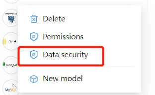
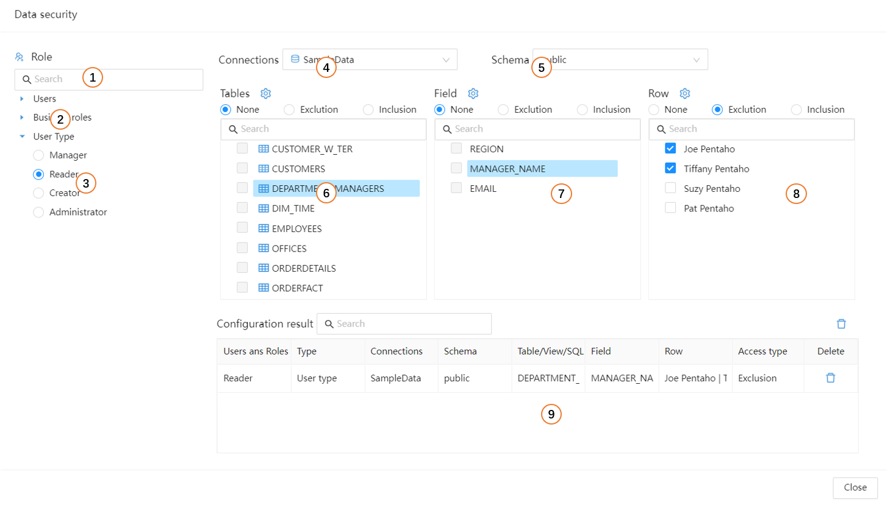
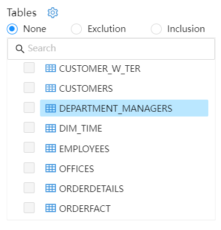
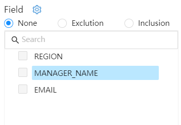
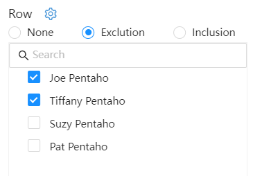

# Data security

Datafor supports setting data access permissions for different users, roles, and user types. The granularity of permission control is the row and column of the database table.
The data permission control is set on the "data source", and the analysis model can control whether to apply the permission settings on the data source.

The data permission setting entry is in the operation menu of "Data Connection":

## Security settings

Select the "Data security" menu of the data connection to display the data security configuration interface.

| Number | Content | Description |
| ---- | -------- | ------------------------------ |
| 1 | User | Select the user who needs to set data security |
| 2 | Role | Select the role that needs to set data security |
| 3 | User Type | Select the user type that needs to set data security |
| 4 | Data Connection | Select Data Connection |
| 5 | Schemas | Schemas in data connections |
| 6 | Tables | All tables and views in a data connection |
| 7 | Columns | Field information of the selected table |
| 8 | Rows | Contents of selected fields |
| 9 | Configuration Results | Configured Data Permission Information |

### "Tables" settings

Set access permissions for the table.

- **None**: Do not set.
- **Exclution**: If the analysis model uses this table as a dimension table, then the dimension of the model is not visible; if the analysis model uses this table as a fact table, then the model will not be available.
- **Inclusion**: The dimensions that use these tables as dimension tables in the analysis model are visible, and other dimensions are not visible.

### "Columns" settings

Set access permissions for data columns.

- **None**: Do not set
- **Exclution**: Excluded fields are not visible in dimensions and metrics.
- **Inclusion**: Included fields are visible in Dimensions and Measure.

### "Rows" settings

Set access permissions for data rows.

- **None**: Do not set
- **Exclution**: Excluded "Rows" are  invisible in the "Values" of dimensions and metrics.
- **Inclusion**: Included "Rows" are visible in the "Values" of Dimensions and Measure.

