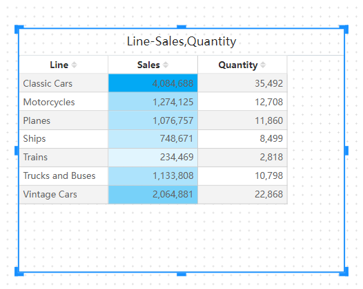

# Conditional Colors

In Datafor, conditional colors are a powerful data visualization feature that allows users to set colors based on specific conditions. This helps quickly identify and analyze patterns and anomalies in the data. This document will explain in detail how to use conditional colors in Datafor.

## What are Conditional Colors?

Conditional colors refer to the automatic application of color formatting to elements in a chart (such as bars in a bar chart, lines in a line chart, cells in a table, etc.) based on data values or expression results. Through conditional colors, differences, trends, and anomalies in the data can be visually displayed.

## Use Cases for Conditional Colors

- **Highlighting Key Data Points**: For example, data points that exceed or fall below a certain threshold.
- **Showing Data Trends**: For example, using color gradients to display trends in sales growth or decline.
- **Comparing Data**: For example, comparing data across different categories or regions.

## Setting Background or Font Colors

To set background or font colors, select "Cell Font Conditional Color" or "Cell Background Conditional Color" from the measure menu.

The Background Color or Font Color dialog box opens with the name of the field being formatted in the title. Select Enable.

## Types of Conditional Colors

### Color Scale Mode

Setting conditional colors using the color scale mode is a common method that displays the range of data values through a gradient. Users can set the minimum and maximum values and choose corresponding colors.

To set cell background or font colors using the color scale mode, select "Color Scale" under "Conditional Type" in the "Background Color" or "Font Color" options. Under "Based on Field," choose the field you want to use as the basis for formatting. You can format based on other measure fields in the model.

Select measure and Min Color and Max Color.

### Rule-Based Mode

Setting conditional colors using the rule-based mode is suitable for scenarios where specific data points need to be highlighted. Users can set one or more specific values and assign a color to each value.

To set cell background or font colors using the rule-based mode, select "Rule-Based" under "Conditional Type" in the "Background Color" or "Font Color" options. Under "Based on Field," choose the field you want to use as the basis for formatting. You can format based on other measure fields in the model.

In the Rule List, create one or more value ranges and set the color for each value range. The cell background or the font in each value range is colored with the given color.

## Summary

The conditional colors feature is an important visualization tool in Datafor that helps users better understand and analyze data. By flexibly applying conditional colors, data can be displayed more intuitively and clearly, thereby enhancing the effectiveness of data analysis.
