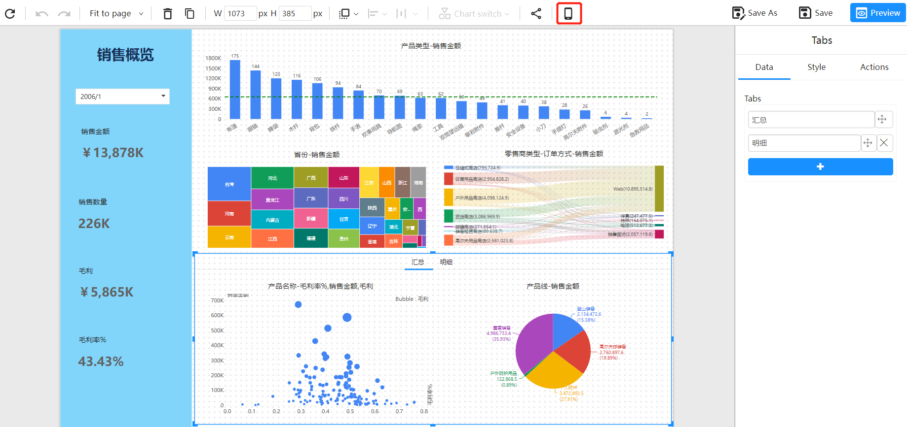
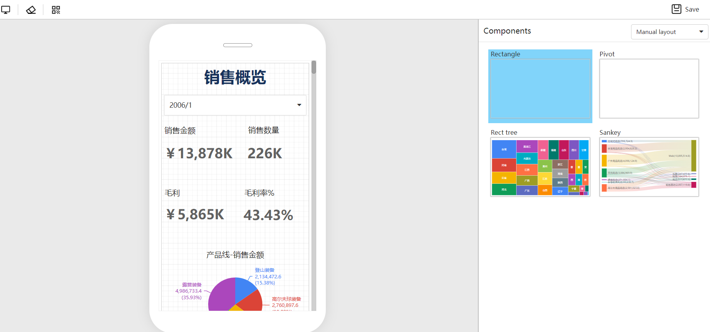
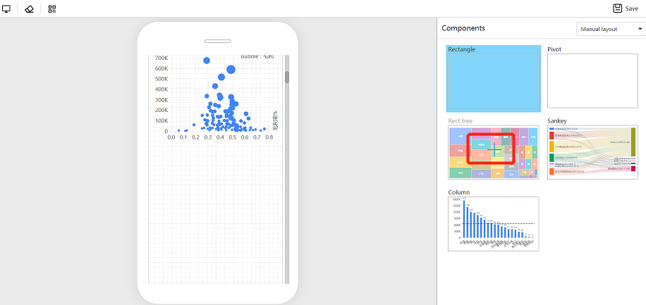
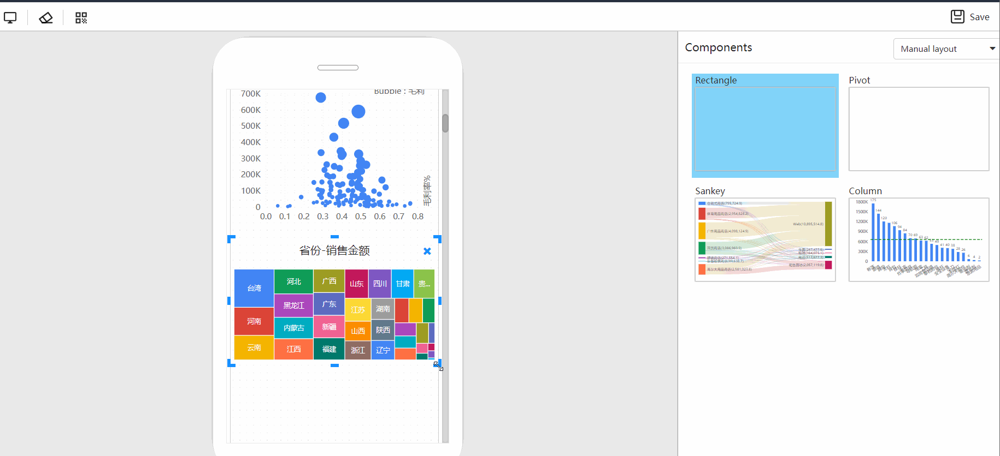
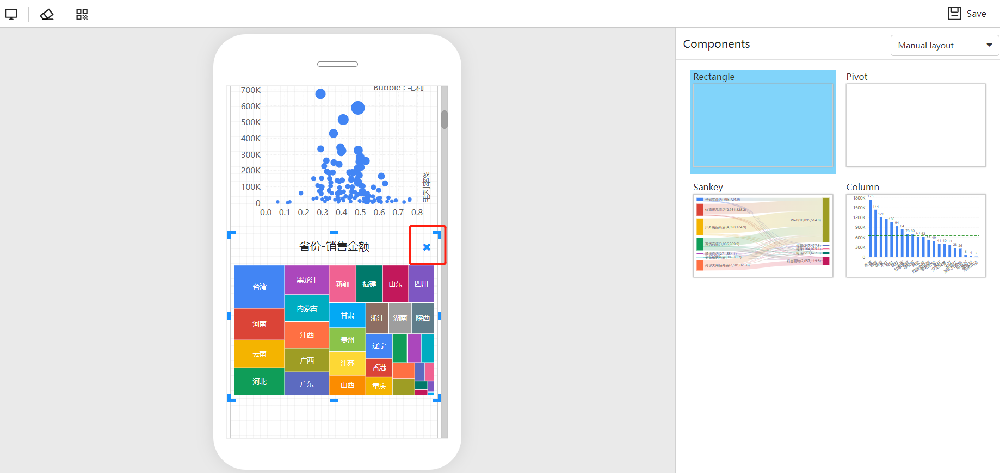
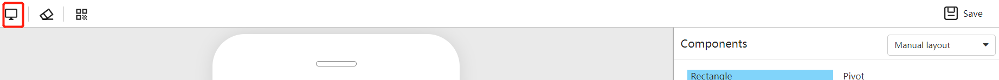

# Mobile Layout View

Analytical reports designed for computer desktops are not suitable for reading and interacting on mobile devices. To address this, DATAFOR provides a "Mobile Layout View" feature that allows the same report page to use different layout views on mobile and desktop.

## How to open Mobile Layout View

Open the Mobile Layout View by clicking the "Mobile Layout" button on the toolbar.

The page switches from the desktop layout view to the mobile layout view.

## Mobile Layout View Settings

### Add components

All elements on the desktop layout are listed on the right panel. You can click the "+" on the component to add it to the mobile layout view.

Components on the mobile layout canvas can be freely dragged and resized.

### Adjust position and size

You can rearrange and layout visual elements and components on the mobile layout canvas.

### Delete components

  - To delete a component from the mobile layout canvas, select the component on the canvas, click the "X" in the upper right corner, or press the Delete key.
  - To delete all components on the canvas, click the "Eraser" button on the toolbar.

  Deleting components from the mobile layout canvas only removes them from the mobile layout canvas. The components return to the "Component List" and can be added back to the canvas, and the original desktop layout report is not affected.

## Switching between Mobile Layout View and Desktop Layout View

Switch the page to the desktop layout view by clicking the "Desktop" icon on the toolbar.

## Features of Mobile Layout View

  - The mobile layout canvas adapts to different widths of mobile device screens.
  - The system automatically detects the type of device accessing the page and switches between desktop and mobile layout views.
  - Mobile Layout View optimizes pop-ups and component zooming on the page.