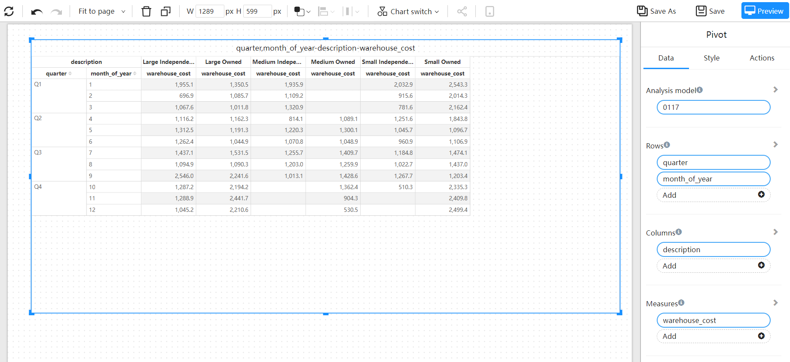
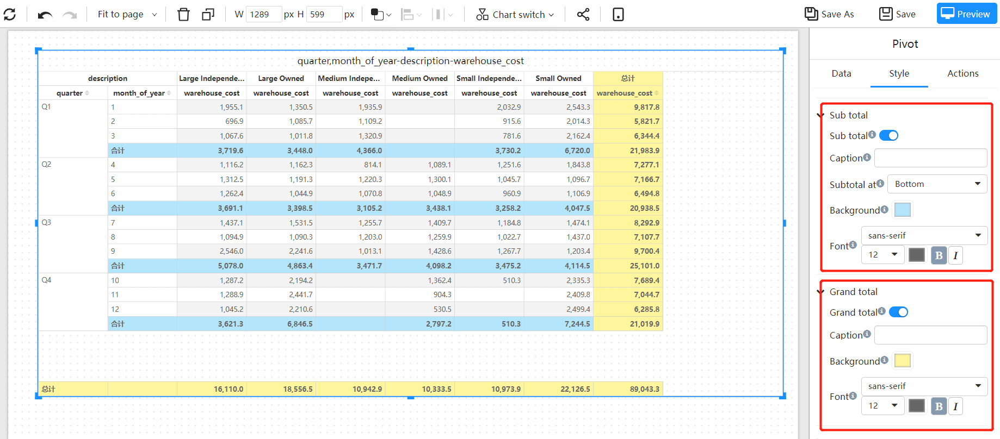

# Pivot table

A pivot table helps users quickly analyze large amounts of data by viewing data from different angles and dimensions and summarizing and calculating the data.

## Applicable scenario

- Summarizing data: Pivot tables can quickly summarize large amounts of data and are easy to use and understand.
- Grouping and aggregating data: Pivot tables can group and aggregate data in many ways, such as by department, salesperson, date, etc.
- Data analysis: Pivot tables can search for trends, patterns, and outliers in data and can dynamically change the grouping and aggregation methods to view different aspects of the data.

## Composition

1. Rows: Represents the categorical variable of each row in the pivot table, such as employee name, date, region, etc.

2. Columns: Represents the categorical variable of each column in the pivot table, such as department, product, etc.

3. Measures: Represents the data records in the pivot table, such as sales, inventory amount, etc.

4. Summary: Used to summarize the data, such as calculating the average, sum, maximum, minimum, etc.

   

## Make a pivot table

1. **Set pivot table data**

   A pivot table consists of three data rows, columns, and measures.

   

2. **Sub total and Grand total**

   Both the row and column fields of the pivot table can be set to sub total summary and grand total summary.

   The "Sub total" and "Grand total" switches in the style panel can turn on or off the total and total row, and can adjust the background color, font size and other style properties.

   
