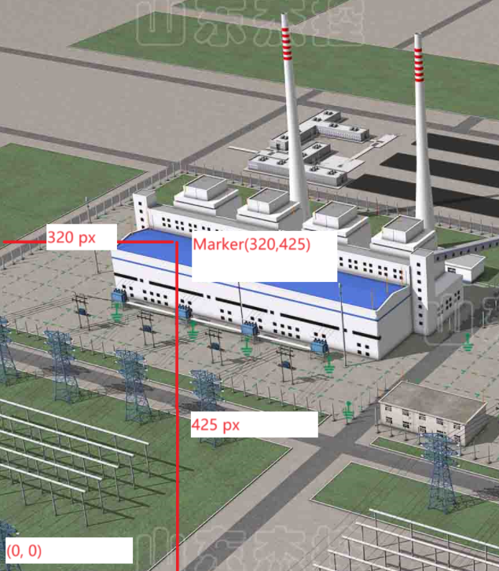
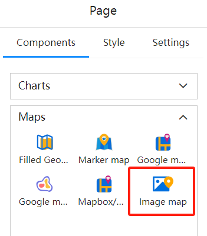
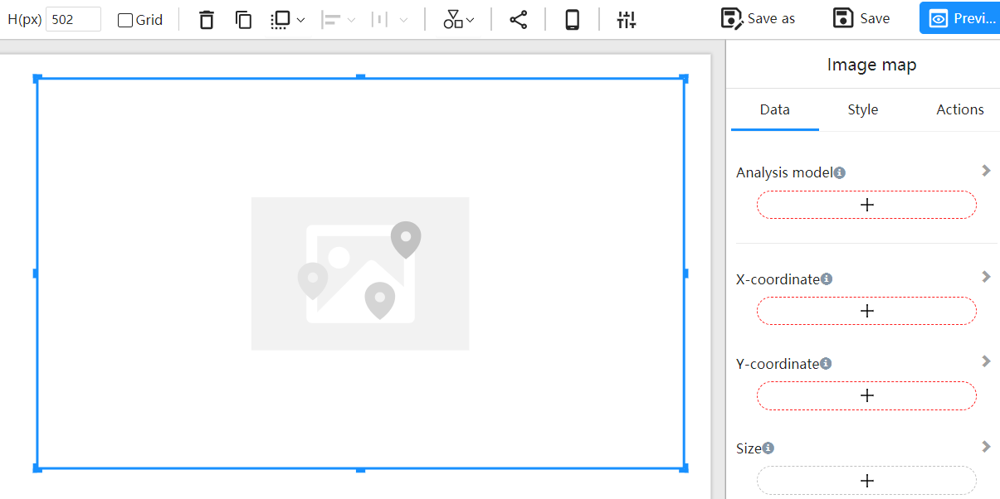
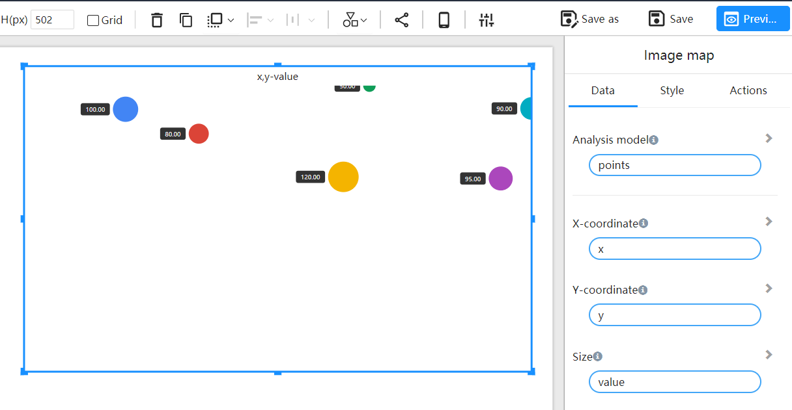
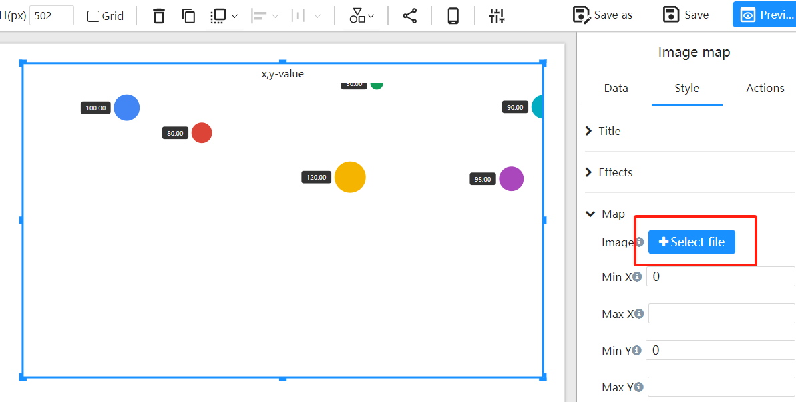
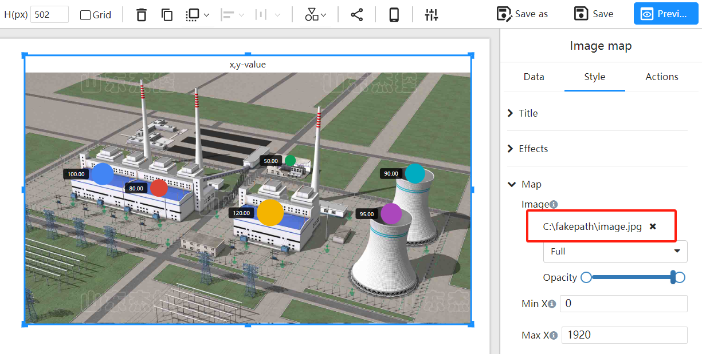
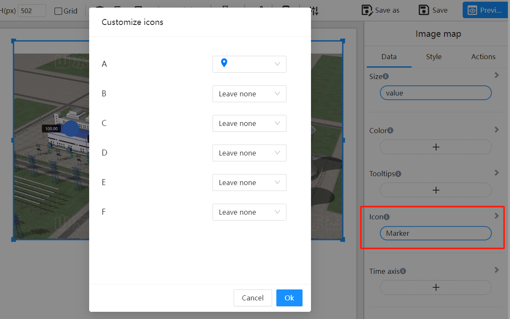
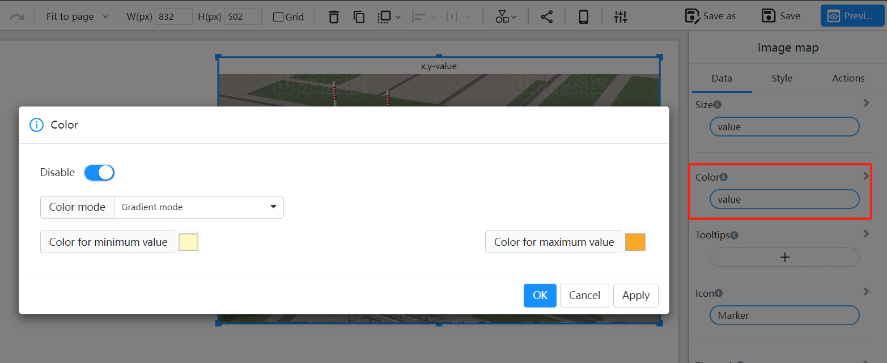

# Image Map

## What is an Image Map?

The "Image Map" component allows users to add markers at specific pixel locations on an image, enabling the identification and display of key information across different areas of the image.

## How to Determine the X and Y Coordinates for Markers?

In an image map, the coordinate system's origin is at the bottom-left corner of the image (0, 0). Specifically:

- **X Coordinate** is the horizontal pixel distance from the origin to the marker.
- **Y Coordinate** is the vertical pixel distance from the origin to the marker.

## Example

### Example Data

The table below lists the coordinates and values for 6 markers:

| Marker | X    | Y    | Value |
| ------ | ---- | ---- | ----- |
| A      | 337  | 645  | 100   |
| B      | 579  | 585  | 80    |
| C      | 1057 | 479  | 120   |
| D      | 1143 | 703  | 50    |
| E      | 1679 | 647  | 90    |
| F      | 1577 | 475  | 95    |

### Steps

1. Select the Image Map component

   

2. Determine the component's position and size on the canvas

   

3. Configure the component data

   

4. Choose the image background

   

5. Adjust markers to fit the image based on pixel location

   

6. Set marker icons

   Choose different icons for markers

   

7. Configure marker colors

   Select color fields, which can be based on values or categories

   

