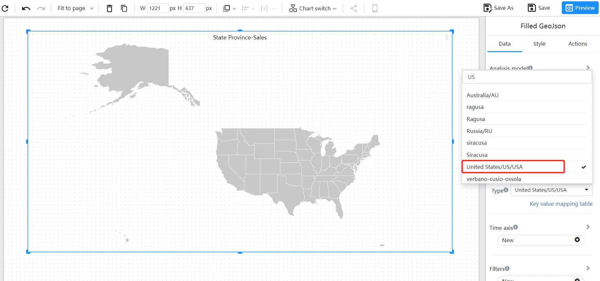
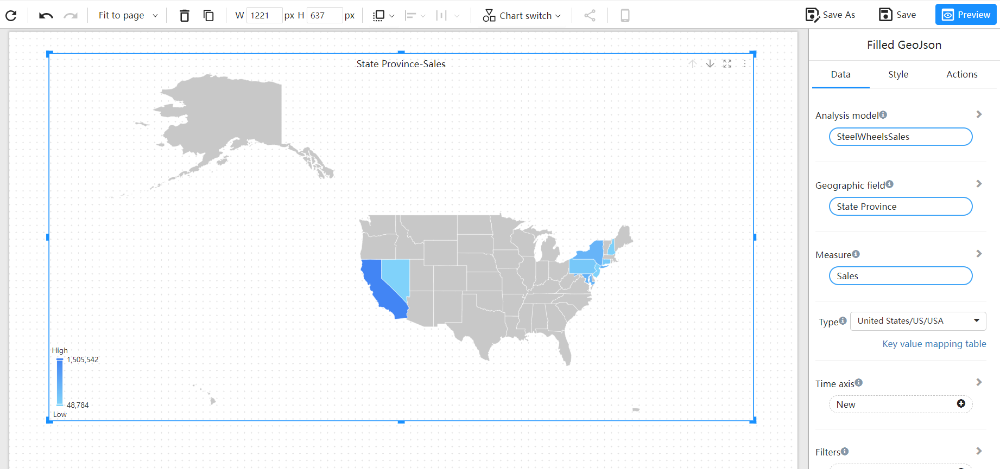

# GeoJSON Filled Map

A GeoJSON filled map combines GeoJSON-format map data with a dataset to fill different areas with different colors to display the data for different regions. GeoJSON is an open standard format that can be used to represent geospatial data. Using a GeoJSON filled map can more accurately display map data, such as administrative divisions like countries, provinces, and cities, while also providing a more intuitive way to visualize the data.

## Creating a Map

1. Create a new report in Datafor and add a GeoJSON marked map component in the report's design mode. This will add a blank map to the canvas area of the report designer.

   

2. Select Map Data

   Select the required map JSON data from the data panel.

   

3. Add Geographic Data Fields

   

4. Customize Map Style
   You can customize the style of the map according to your preferences, including background color, border lines, labels, etc.

## FAQ

1. How do I match the names of my regions with the names of the regions in the GeoJSON file?

   You can maintain the mapping between the names of the regions in your map and the data in the "key-value mapping table".

   

2. Can I customize my own GeoJSON map?

   Yes, you can contact Datafor to customize a GeoJSON map for you.

   Contact email: marketing@datafor.com.cn

