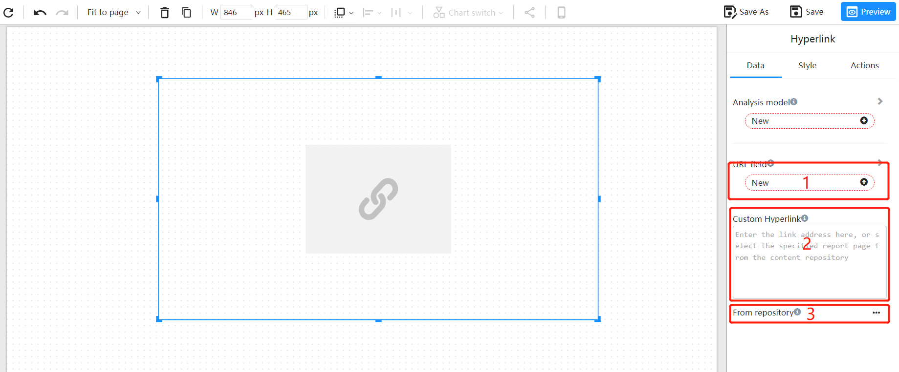

# Hyperlink

When using the Datafor hyperlink component, there are three ways to specify a link:

1. Get the link from a database field: Select a database field that contains the URL to link to. Add the field to the hyperlink component and the link will display as the URL in that field.
2. Manually enter a link: Enter the URL in the hyperlink component and the link will display as the entered URL.
3. Select a link from a Datafor report page: Select a Datafor report page in the hyperlink component and the link will point to that page.

