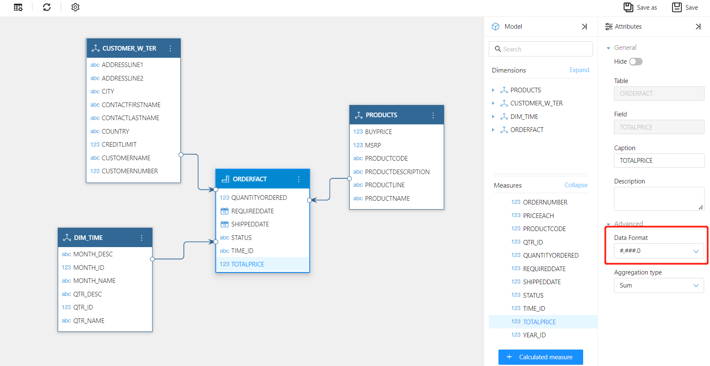
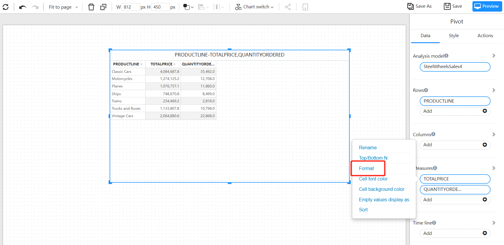
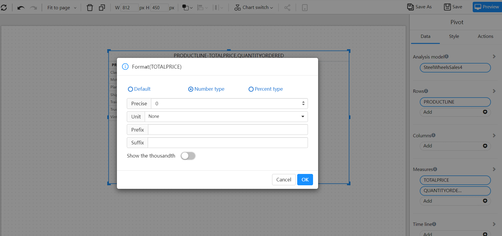

# Numerical display format

The number display format can be set on the analysis model or on the component of the analysis report.

## Set the numerical display format on the analysis model

Select the data display format on the properties panel of the analysis model

## Set the numerical display format on the report component

- Select "Format" on the measure operation menu of the component to enter the data format setting window.

  In the pop-up settings window, set:

  - Data display accuracy
  - Numeric prefix and suffix characters
  - number thousand sign
  - Percentage display accuracy
  

