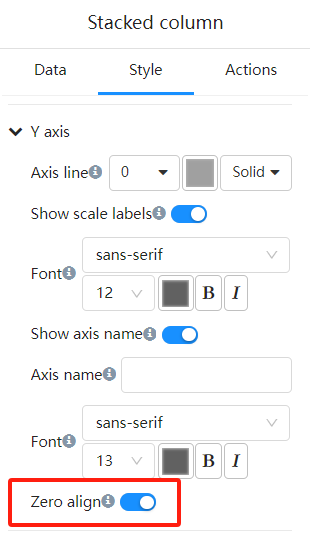
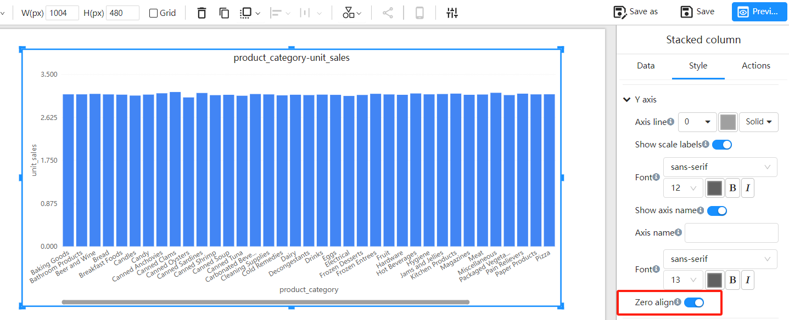
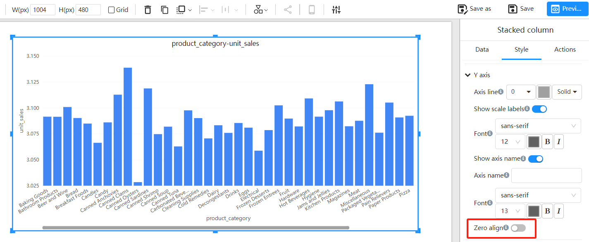

# Y-Axis Zero Align

The Y-axis zero alignment feature in Power BI forces the starting point of the Y-axis to be set to zero. This feature is crucial for axis-type charts such as column charts, line charts, and area charts, as it ensures consistent and accurate data visualization.

## Why Use the Zero Align?

1. **Data Consistency**: Zero alignment ensures that data is displayed starting from zero, avoiding misleading visualizations caused by varying starting points.
2. **Visual Effect**: A uniform starting point helps viewers compare different data points more intuitively.
3. **Data Accuracy**: It prevents misunderstandings caused by non-zero starting points, ensuring the data display accurately reflects the actual situation.

## Enabling the Y-Axis Zero

1. In the "Format" panel, expand the "Y-Axis" options.

2. Find the "Zero align" toggle.

## Examples

**Zero Align On**

Y-Axis minimum value: 0

**Zero Align Off**

Y-Axis minimum value is automatically calculated based on the data range.

## Frequently Asked Questions

**Q1: Why does my chart look the same after enabling zero align?**

**A1:** If there are no significant changes in the chart data itself, the visual effect may not be noticeable after enabling zero alignment.

**Q2: Can I set zero align for both the X-axis and Y-axis?**

**A2:** Zero alignment is typically applied to the Y-axis. However, for some charts like scatter plots, the X-axis start value can also be set to zero.