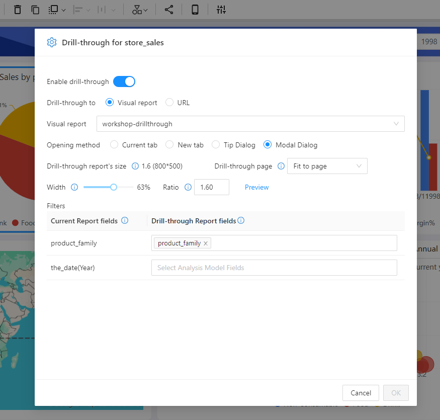
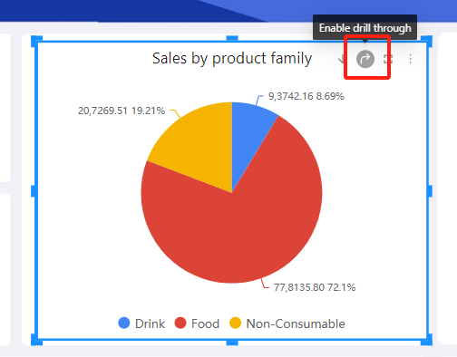

## What is "Drill through"

**"Drill through"** is a function that allows users to jump from a summary view to a new detailed view, providing more information related to the selected data.

------
## How to Set Up "Drill-through"

1. Select **"Drill through"** from the **field menu** of the chart component.

   

2. Configure the Drill-through Settings

   

   **Drill-through to:** Choose the drill-through target, which can be a visual report or a URL link.

   **Visual report:** Select a visual report from the Datafor resource library.

   **Opening method:** Select how to open the target page.

   **Drill-through report's size:** View the aspect ratio and pixel size of the target page.

   **Drill-through page:** Set the size of the drill-through page within the container.

   **Width:** The width ratio of the container to the current page.

   **Ratio:** The aspect ratio of the drill-through page container.

   **Filters:** Set the filter values to pass to the drill-through page. The values can include the field values selected in the chart component data panel and the values of the filter components that filter this chart component.

## How to Use "Drill-through"

1. Enable the drill-through function for the chart component. Select "Enable Drill-through" from the toolbar of the chart component.
   

2. Click the relevant area of the chart component to open the drill-through page.
   

## Summary

Datafor's "Drill-through" feature provides users with a powerful tool for deep data exploration. By effectively utilizing "Drill-through," users can gain a more comprehensive understanding of their data, supporting deeper business insights and decision-making.