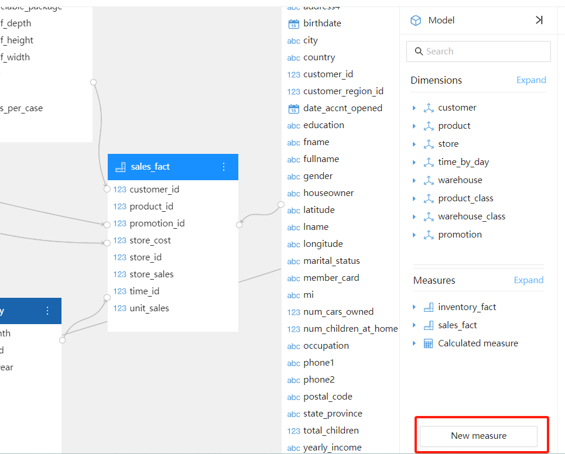
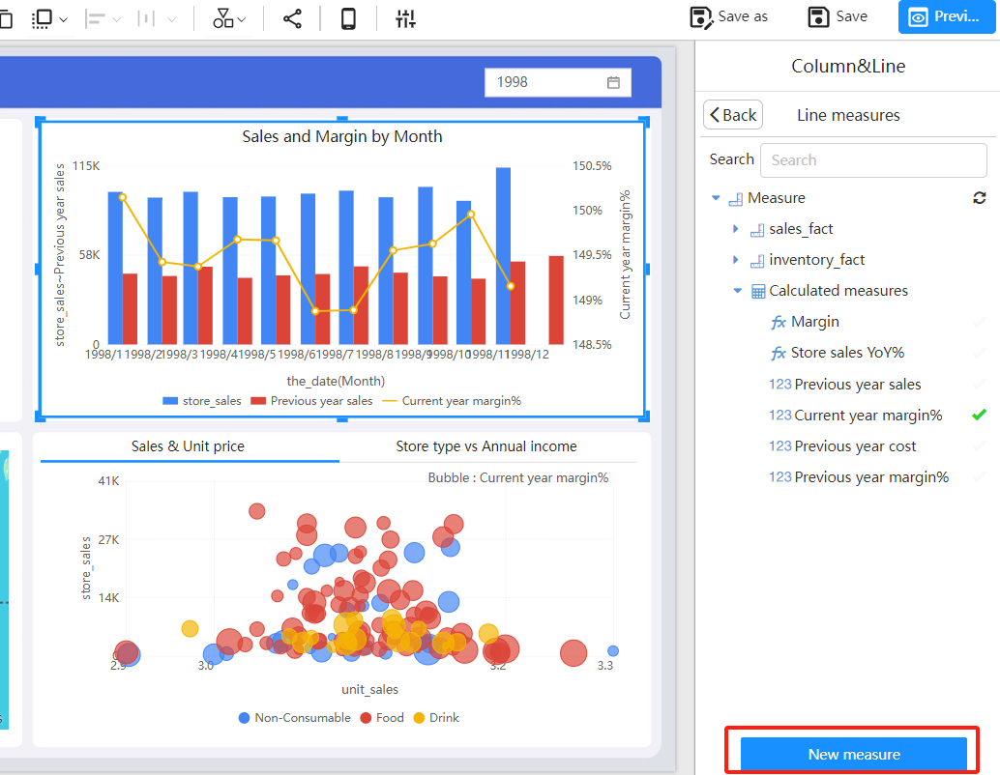
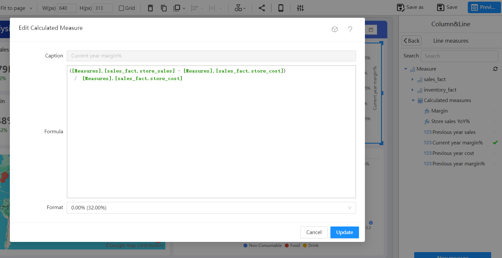

# Calculated Measures

Datafor offers robust calculated measures functionality, allowing users to define complex calculation logic for use in reports and dashboards.

## What are Calculated Measures?

Calculated measures are user-defined metrics created by performing calculations on existing data to generate new values. These calculations can be simple, like sums or averages, or more complex, like time intelligence calculations and custom business logic. Calculated measures enable users to create dynamic and flexible analyses based on specific business requirements.

## Defining Calculated Measures with MDX

MDX (Multidimensional Expressions) is a specialized language for querying and manipulating multidimensional data. Datafor uses MDX to define calculated measures, providing users with powerful calculation and analysis capabilities. MDX offers a range of functions and operators to handle complex multidimensional data calculation needs.

[MDX Functions](https://datafor123.github.io/docs/en/120 advanced/advanced-mdx)

### Example: Simple Calculated Measure

For example, you can create a simple calculated measure to calculate total sales:

```
SUM([Sales].[Amount])
```

### Example: Time Intelligence Calculated Measure

MDX also supports complex time intelligence calculations. For instance, you can create a calculated measure to calculate year-over-year growth:

```
([Measures].[Sales Amount], [Date].[Calendar].CurrentMember) - 
([Measures].[Sales Amount], [Date].[Calendar].CurrentMember.PrevYear)
```

## Creating Calculated Measures in Datafor

### Creating in the Analysis Model

<div align="left"></div>

### Creating in the Report Edit View

<div align="left"></div>

## Using Calculated Measures in Reports

Once created, calculated measures can be used in Datafor's reports and dashboards.

### Example: Using a Calculated Measure in a Dashboard

You can add the previously created `Current year margin%` calculated measure to a dashboard.

```
SUM([Sales].[Amount])
```

<div align="left"></div>

In this way, you can view and analyze the changes in margin percentage in real-time on your dashboard.

<div align="left"></div>

## Summary

Datafor's calculated measures functionality, using the MDX language, provides users with powerful data calculation and analysis capabilities.