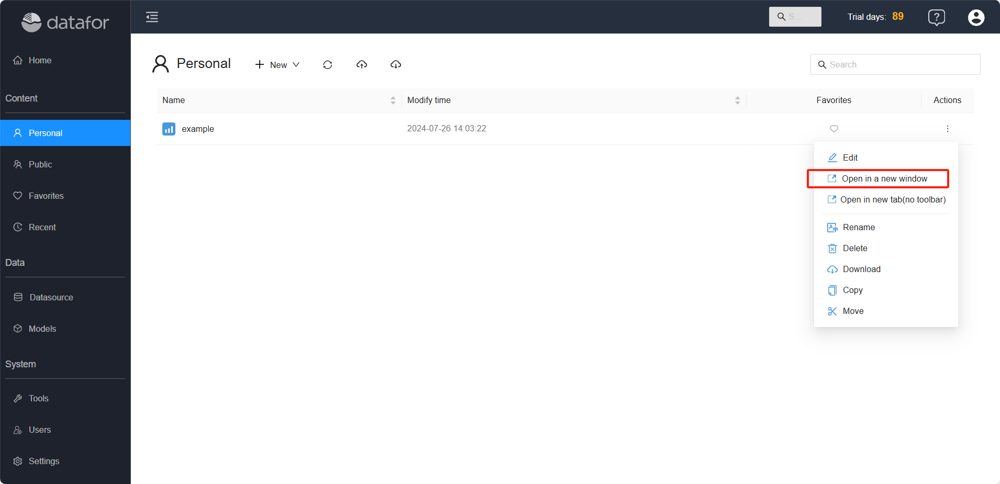
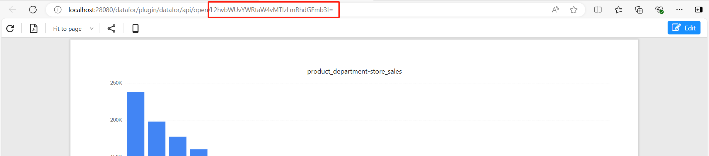
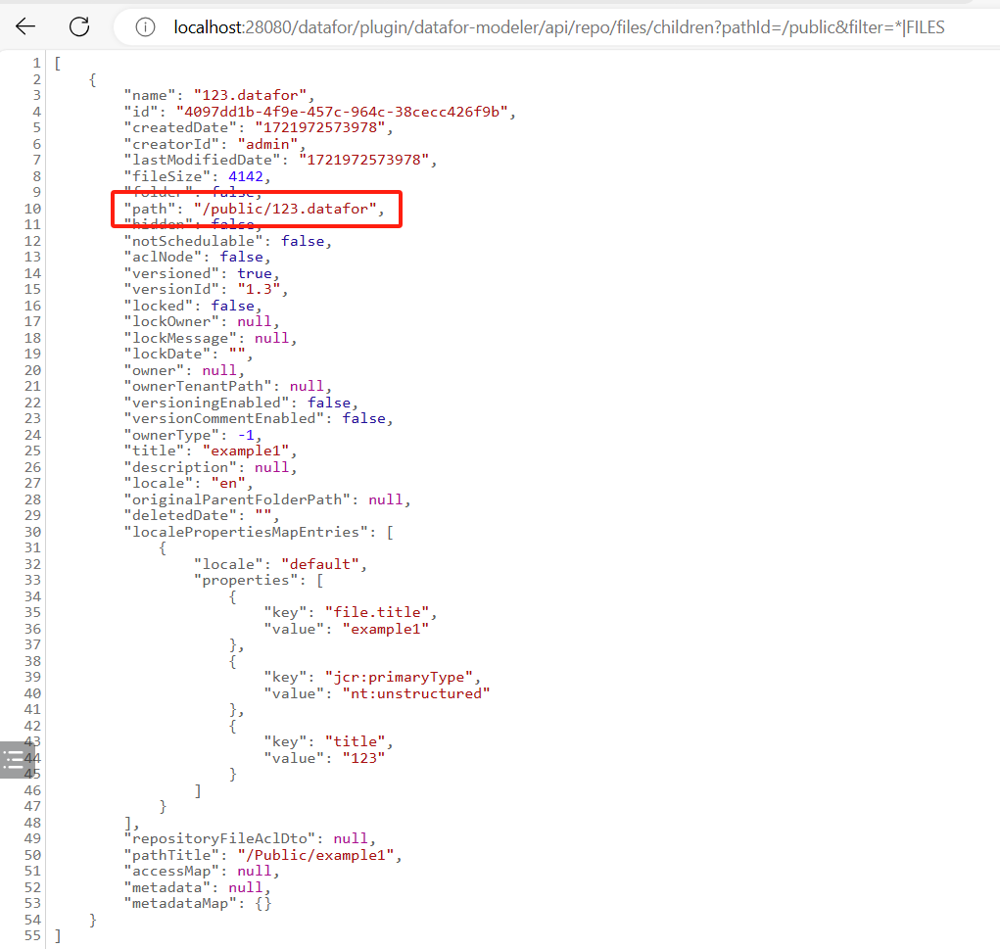

# Reports REST API

Datafor provides a suite of REST APIs that allow users to interact with reports via HTTP requests.

## Open a Blank Report Designer

`http://localhost:28080/datafor/plugin/datafor/api/createDo`

## Open a Report

**URL Format**: http://`<datafor-server>`/datafor/plugin/datafor/api/`<mode>`/`<report id>`?`<parameter>&<parameter>`

### Parameters:

- `<datafor-server>`: The datafor server address.

- `<mode>`: The mode for opening the report, with three options:
  
  - **edit**: Opens the report in edit mode.
  - **open**: Opens the report in view mode.
  - **integrate**: Opens the report in embed mode, typically used for embedding the report in other pages via an iframe.
  
- `<report id>`: The ID of the report.

- `<parameter>`: Parameters for **integrate mode** URL:

  -  **__compact=true**: Removes the report page's outer margins.
  - **__clean=true**: Removes the default shadow effect of the report page.
  - **__forceAdjust=true**: Adjusts the report width to fit the container.

  **Note: "__" represents two consecutive underscore characters.**

### Examples

- Open the report in edit mode: `http://localhost:28080/datafor/plugin/datafor/api/edit/L2hvbWUvYWRtaW4vZXhhbXBsZTEuZGF0YWZvcg==`


- Open the report in view mode: `http://localhost:28080/datafor/plugin/datafor/api/open/L2hvbWUvYWRtaW4vZXhhbXBsZTEuZGF0YWZvcg==`


- Open the report in embed mode: `http://localhost:28080/datafor/plugin/datafor/api/integrate/L2hvbWUvYWRtaW4vZXhhbXBsZTEuZGF0YWZvcg==`


- Open the report in embed mode and remove the page's outer margins: `http://localhost:28080/datafor/plugin/datafor/api/integrate/L2hvbWUvYWRtaW4vZXhhbXBsZTEuZGF0YWZvcg==?__compact=true`


- Open the report in embed mode, remove the page's border shadow, and adjust the width to fit the iframe container: `http://localhost:28080/datafor/plugin/datafor/api/integrate/L2hvbWUvYWRtaW4vZXhhbXBsZTEuZGF0YWZvcg==?__clean=true&__forceAdjust=true`


## How to Retrieve a Report ID

### Method 1: Copy from URL

1. Open the report in a new window

   <div align="left"></div>

2. The report ID can be found in the browser's address bar.

   <div align="left"></div>


### Method 2: Generate using code

1. Use the API to get the file path.

   For example:

   ```
   http://localhost:28080/datafor/plugin/datafor-modeler/api/repo/files/children?pathId=/public&filter=*|FILES
   ```

   <div align="left"></div>

2. Encode the path using the Base64 method

   ```
   window.btoa(unescape(encodeURIComponent("/public/123.datafor"))).replace(/\+/g, "-").replace(/\//g, "_");
   ```

   
