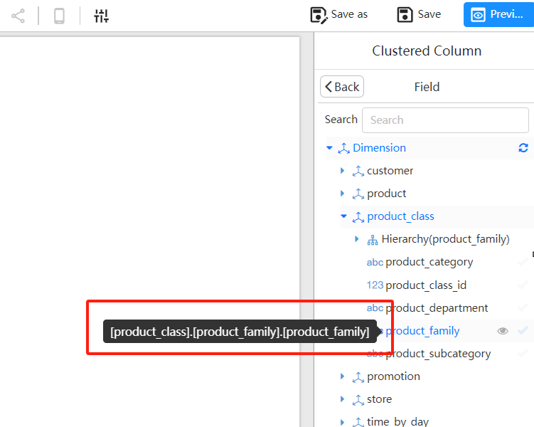
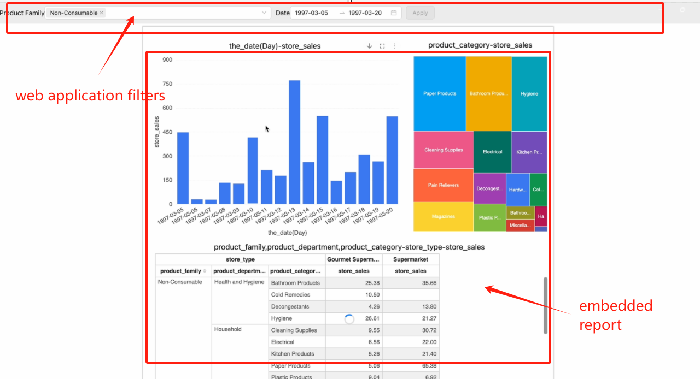

# Embedding Reports Using XDM

> **Note:**
> The term "**report**" in this document refers to the visual reports created using Datafor or the Visualizer plugin.

Reports support XDM (Cross-Document Messaging) for filtering report data without refreshing the report page. XDM allows control over the report's data filtering, styles, and behavior; however, this document focuses solely on data filtering scenarios.

## What is XDM (Cross-Document Messaging)?

XDM (Cross-Document Messaging) is a technology that allows secure communication between different web pages or applications from different origins (such as different domains or subdomains). Typically, browsers restrict different-origin pages from accessing each other's content to protect user privacy and security. However, in some cases, such as when embedding external content, different-origin pages need to communicate, and XDM can be used for this purpose.

Web applications use the `postMessage` API to communicate with the report, sending parameter values to the report. The report then distributes these parameter values as filters to the individual chart components, which re-query data to achieve the filtering effect.

XDM enables cross-origin communication between web pages without compromising browser security.

## Application Scenarios:

When embedding a report within a web application using an iframe, the following scenarios may arise:

1. Passing parameters to the report during initial loading to filter report data.
2. Changing parameter values in the web application after the report has loaded and passing these values to the report to filter data (without reloading the report).

## Steps:

### **Importing the `XDMWorker` Class in the Main Program:**

In the main program that calls the report, add the following `XDMWorker` class to facilitate the forwarding of `XDM` messages. The main program can use the `send` method of this class to pass filter parameters to the report.

```js
class XDMWorker {
    constructor({ onPageInitEvent = () => { } }) {
        this.reportId = null;
        window.addEventListener('message', (msg) => {
            const { data } = msg;
            let reportMessage;
            try { reportMessage = JSON.parse(data); } catch (d) { }
            if (reportMessage) {
                if (reportMessage.event == 'visualizerReportFileLoaded') {
                    this.reportId = reportMessage.id;
                    onPageInitEvent();
                }
            }
        });
    }

    send(data, target, init = false) {
        if (!this.reportId) {
            console.error('No reportId found, please wait for the report to be loaded');
            return;
        }
        const message = {
            trustMark: this.reportId,
            event: 'query',
            init,
            filters: data,
        };
        target?.postMessage(JSON.stringify(message), '*');
    }
}
```

### Scenario 1: Passing Parameters to the Report During Initial Loading to Filter Data

1. **Initialize an XDMWorker Object Before Calling the Report:**

   Before calling the report, initialize an `XDMWorker` object. To filter report data during the initial load, call the `send` method within the `onPageInitEvent` event, setting the third parameter to `true`.

   **Example:**

   ```
   const xdm = new XDMWorker({
       onPageInitEvent: () => {
          iframeRef?.current && xdm.send(
                  [
                     {
                       value: [
                         'product_family_1', 
                         'product_family_2' 
                       ],  
                       name: '[product_class].[hierarchy_product_family].[product_family]',  
                       type: 'name',  
                       datatype: 'string'  
                     }
                  ], 
                  iframeRef.current?.contentWindow, 
                  true  
              );
       }
   });
   ```

   **Parameter Description:**

   ```
   [{
       value: [
           [
               {i: 0|1, v: string},  
               {i: 0|1, v: string}
           ], 
           string,  
       ],  
       name: string,  
       type: 'name'|'caption',  
       datatype: 'string'|'numeric'|'timestamp'  
   }]
   ```

   - **value:** Parameter values from the web application.

   | Value Type                                                   | Example                                                      |
   | ------------------------------------------------------------ | ------------------------------------------------------------ |
   | x in ('a', 'b', 'c')                                         | {'value':['a', 'b', 'c'],'datatype':'string'}                |
   | x >= 1 and x < 3                                             | {'value':[{'i':'1','v':'1'},{'i':'0','v':'3'}],'datatype':'numeric'} |
   | x between (2, 5) or x between (4, 6)                         | {'value':[['2', '5'], ['4', '6']],'datatype':'numeric'}      |
   | x between (2, 5) or x between (4, 6) or x in (7, 8)          | {'value':[['2', '5'], ['4', '6'], '7', '8'],'datatype':'numeric'} |
   | x >= '2024-01-01 00:00:00+8' and x < '2025-01-01 00:00:00+8' | {'value':[{'i':'1','v':'1704038400'},{'i':'0','v':'1735660800'}],'datatype':'timestamp'} |

   - **name:** The unique name of the field in the report’s analytical model.
   - **type:** Specifies whether the parameter value is applied to the field’s name or caption.
   - **datatype:** The data type of the filter value.

2. **Call the Report**

   - Obtain the report's embedding mode URL.

     [Reference Document](https://help.datafor.com.cn/docs/en/80 share/jcyfx-report-api)

   - Add a "delay time parameter" to the report URL:

     Add the **delay time parameter** `__xdmTimeout=150` to the report link, e.g., `http://localhost:28080/datafor/plugin/datafor/api/integrate/L2hvbWUvYWRtaW4vZXhhbXBsZTEuZGF0YWZvcg==?__xdmTimeout=150`.

     > **Note:**
     > **What is the "delay time parameter"?** After the report is opened, it will broadcast a report initialization message and wait for 150ms. If a valid response is received within the wait time, the parameters in the response are used as the initial data filter values. You can adjust this delay time based on the main program’s response speed. If data filtering is not required during the initial report load, this parameter can be omitted.

### Scenario 2: Changing Parameter Values in the Web Application After the Report Has Loaded to Filter Data (Without Reloading the Report)

1. **Call the send Method**

   After the report page is opened, if you need to pass parameter values from the web application to the report, you can call the send method in the main program. The report will immediately respond and re-query the data.

2. **send Method Call Format:**

   ```
   send(message, target)
   ```

   **Parameter Description:**

   - **message:** The filter parameters in the following format:

     ```
     [{
         value: [
             [
                 {i: 0|1, v: string},  
                 {i: 0|1, v: string}
             ], 
             string,  
         ],  
         name: string,  
         type: 'name'|'caption',  
         datatype: 'string'|'numeric'|'timestamp'  
     }]
     ```

   - **target:** The window object of the iframe where the report is opened.

## How to Obtain the `uniqueName` of Analytical Model Fields?

In the report designer, when selecting analytical model fields, you can view the `uniqueName` through the tooltip.

The `uniqueName` of the `product_department` field in the image below is `[product_class].[product_department].[product_department]`.


<div align="left"></div>

## Sample Project

Please refer to the sample project: https://github.com/datafor123/visualizer-xdm-demo

<div align="left"></div>
