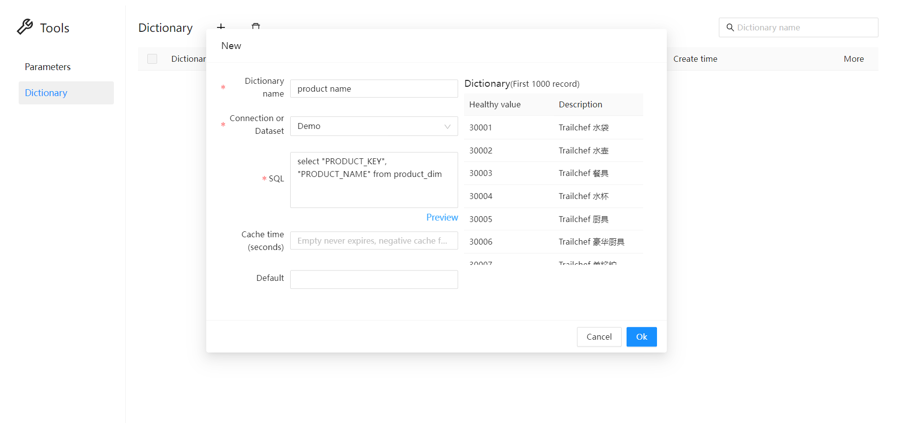
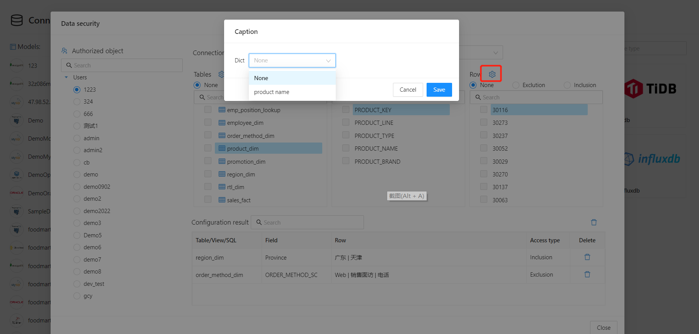

# Data Dictionary

## What is a data dictionary?

A data dictionary contains two fields: key and value. The key of the data dictionary is used to associate with other fields, and the value will replace the key value referenced by the data dictionary.

## Creating a data dictionary

Create a new data dictionary in the data dictionary management.

Click the "Add" button.

The data dictionary is defined through SQL statements, and the first field returned by the SQL statement serves as the "key" of the data dictionary, and the second field serves as the "value" of the data dictionary.

## Using a data dictionary

Currently, Datafor can use data dictionaries in two places:

### 1. Dimension fields in the analysis model

The dimension fields in the analysis can replace the values of field members with data dictionaries.

### 2. Data permission configuration interface

The data permission configuration interface can reference data dictionaries to describe table names, field names, and field values.

