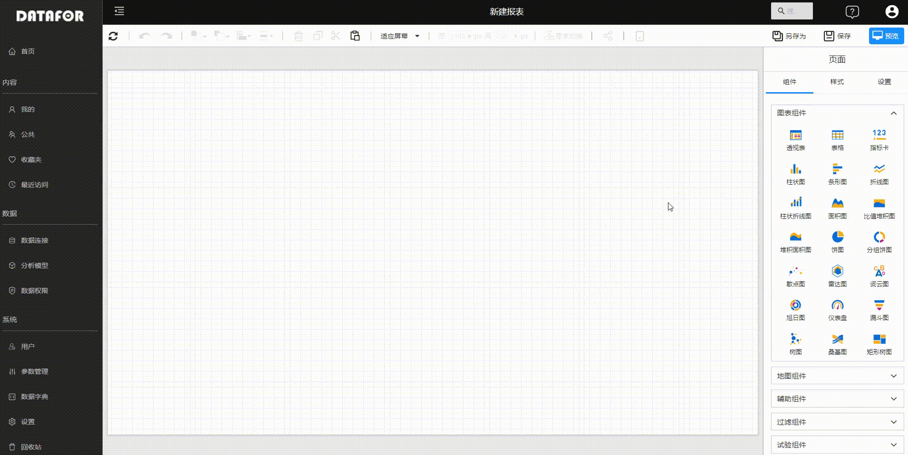
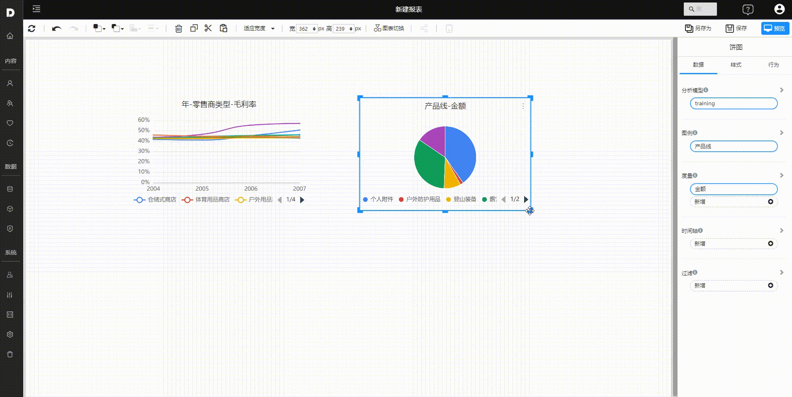
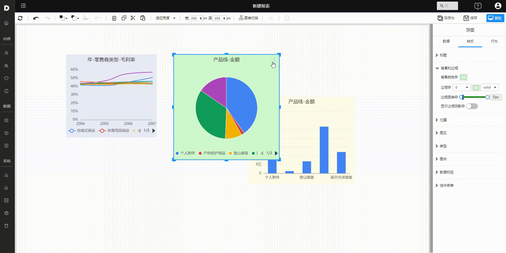
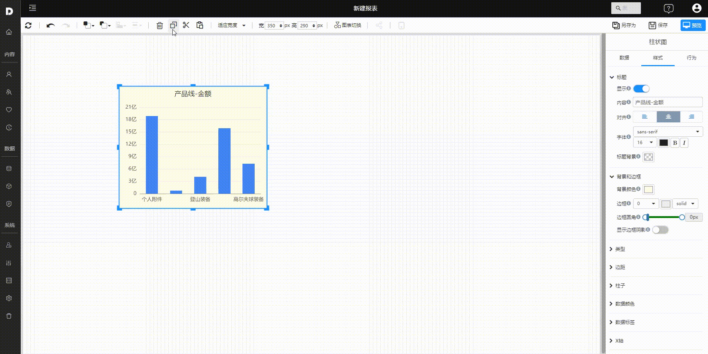

# Basic Operations for Creating Pages

Datafor offers flexible and powerful dashboard and report creation capabilities, allowing users to manage and adjust visualization components on the canvas. This document will introduce these key features, including adding, deleting, resizing, moving, aligning, distributing, layering, switching types, and copying components.

## Adding and Deleting Components

### Adding Components

- Select a component from the right-side component panel.
- Click on the desired component type to add it to the report canvas.
- Drag fields from the field panel to the appropriate areas in the component, such as values, axes, legends, etc., to populate data.

### Deleting Components

- Click to select the component you want to delete, or press Ctrl + click to select multiple components.
- Press the Delete key on the keyboard, or click the "Delete" button on the toolbar.

## Resizing Components

**Using Handles**:

- Select the component.
- Drag the resize handles at the corners or edges to adjust the component size.

**Entering Width and Height Values**:

- Enter the width and height values directly in the width and height input boxes on the toolbar. This method is particularly effective when resizing multiple components simultaneously.

## Moving Components

**Drag and Drop**:

- Select one or multiple components.
- Drag the components to the desired position on the canvas.

## Aligning and Distributing Components

**Aligning**:

- Hold down the Ctrl key and click each component to select multiple components.

- On the toolbar, click the “Align"  and choose the alignment method.

**Distributing**:

- Select multiple components.

- On the toolbar, click the "Distribute" and choose horizontal or vertical distribution.

## Layering Components

- Right-click the component.

- On the toolbar, select the “ layer” button to adjust the component's layer position.

## Copying Components

Datafor supports copying/cutting and pasting single or multiple components, including cross-page operations.

- Select one or multiple components and use the copy, cut, and paste buttons on the toolbar.
- Select one or multiple components and use the keyboard shortcuts Ctrl+C (copy), Ctrl+X (cut), and Ctrl+V (paste).

## Switching Component Types

During the design process, you can switch component types while maintaining the original component's data model.

These features allow users to customize their Datafor dashboards and reports efficiently, ensuring that their data is presented clearly and effectively.

