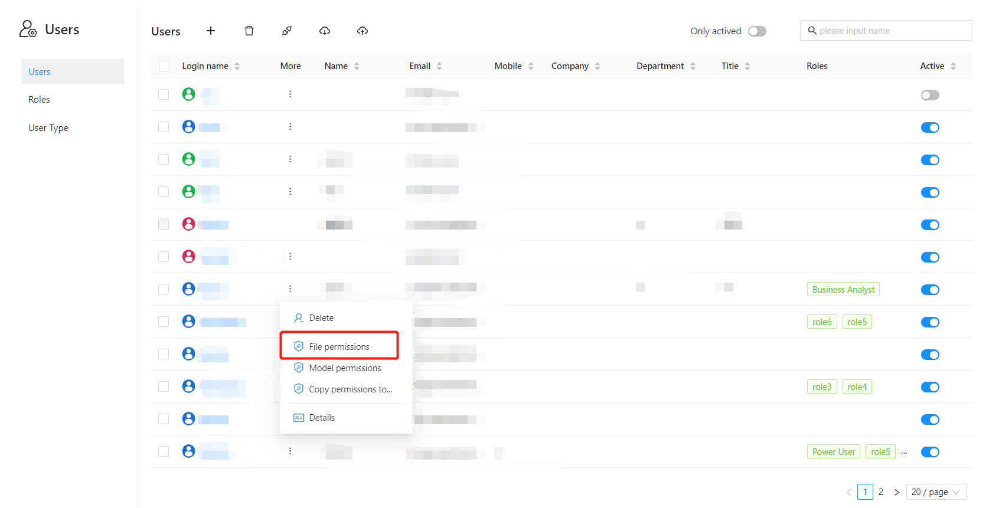
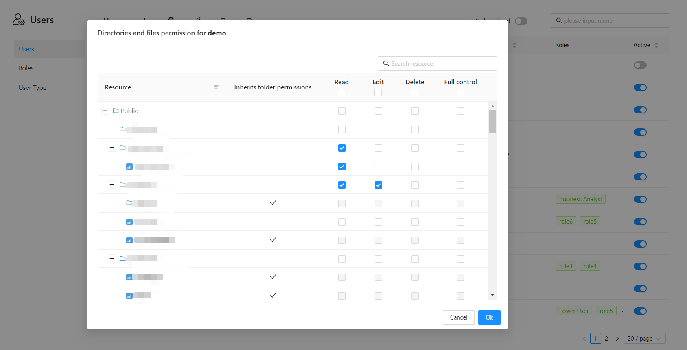
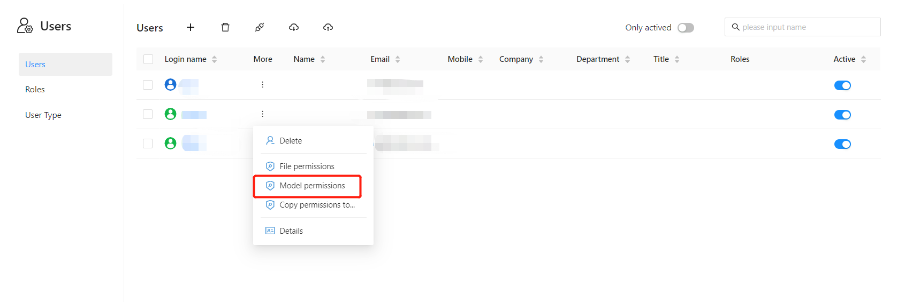
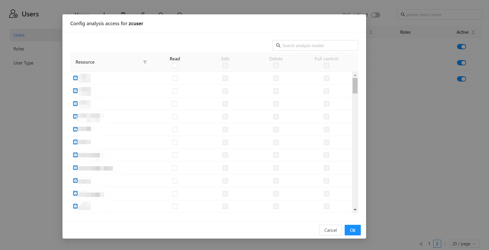
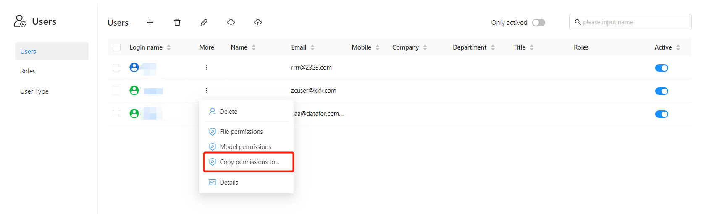
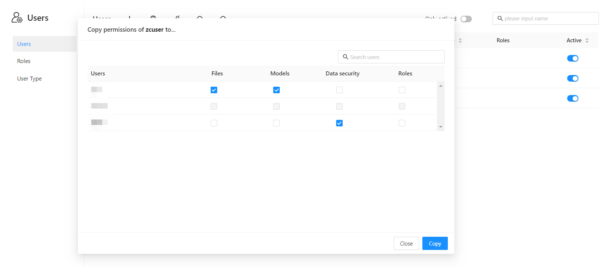

# Authorize a user or role

Usually adding a new user or role requires authorization.

## Folders and files

1. Enter the user management interface and select the "File permissions" menu item

   

2. Set access permissions for files and directories

   

| Permissions | Description |
| ------------ | ------------------------------------ -- |
| View | Allow View Content |
| Edit | Allow viewing, editing content |
| Delete | Allows viewing, editing and deleting content |
| Full Control | Allow View, Edit, Delete, and Allow Setting Permissions |

## Analysis Model

1. Enter the user management interface and select the "Model permissions" menu item

   

2. Set up analysis model access permissions

   

| Permissions | Description |
| ------------ | ------------------------------------ -- |
| View | Allow View Content |
| Edit | Allow viewing, editing content |
| Delete | Allows viewing, editing and deleting content |
| Full Control | Allow View, Edit, Delete, and Allow Setting Permissions |

## Copy permission settings to other users or roles

1. Enter the user management interface and select the "Copy permission to..." menu item

   

2. Select what to copy and "Copy to"

   
