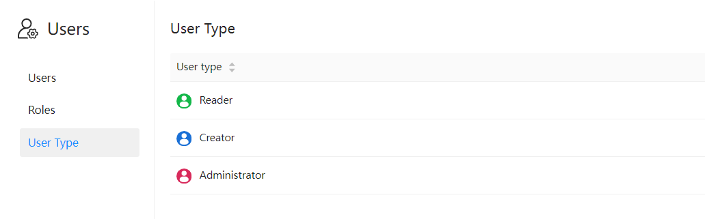

# User Types

There are four types of users in Datafor, and it is necessary to specify a user type when creating a user.

- **Read-only user**: can only view reports.
- **Authoring user**: can create data connections, analytical models, analysis reports, and other authorized tools.
- **Administrator user**: in addition to the authoring user's permissions, also has system management, user management, and other permissions.
- **Super Administrator**: in addition to the permissions of an administrative user, has management permissions for all files in the "Public" folder, as well as all data sources and analytical models.

Except for the "Super Administrator," other user types can be authorized separately, including data connection permissions, analytical model permissions, and file and directory permissions.

