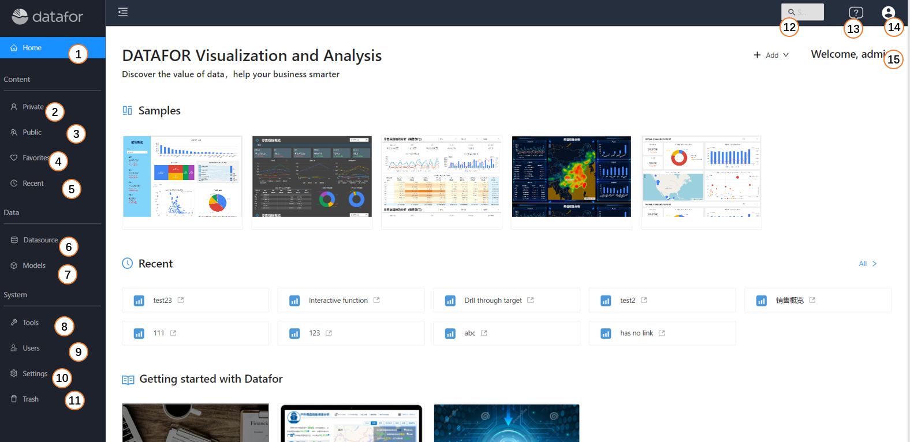
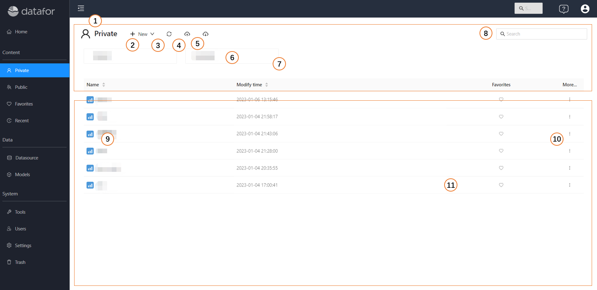
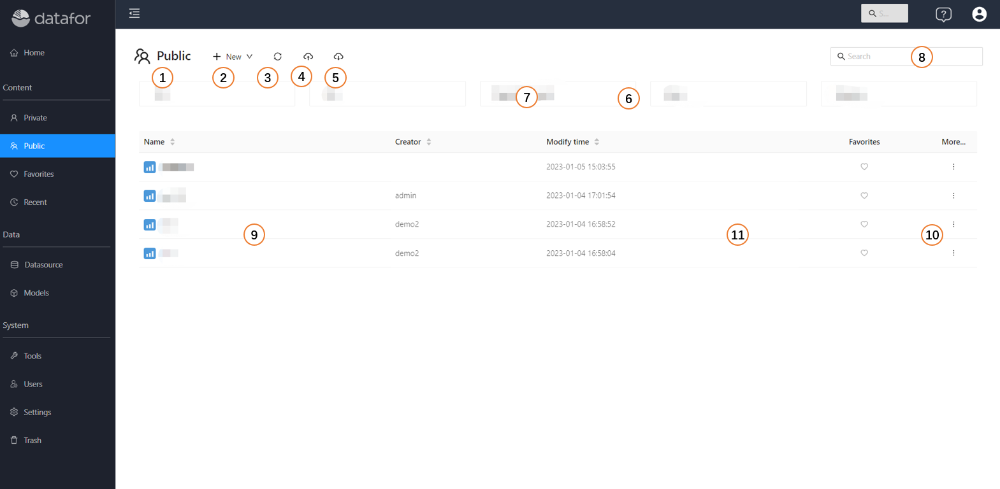
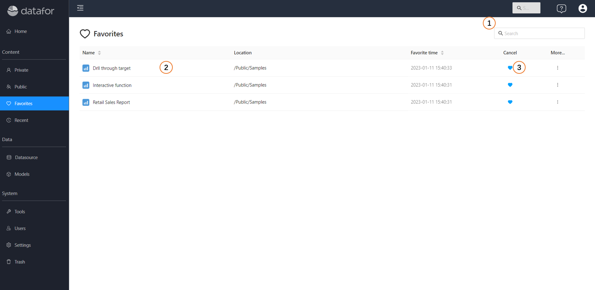
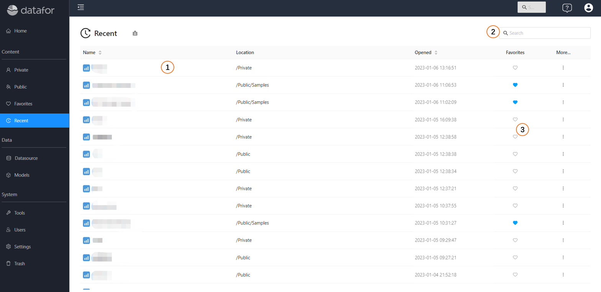
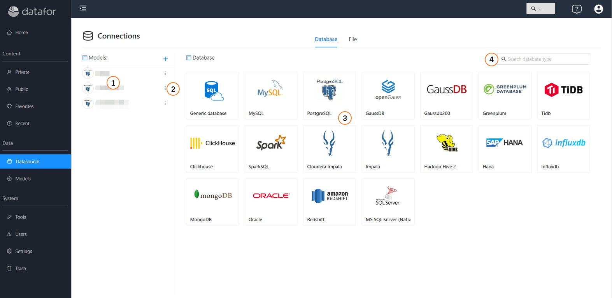
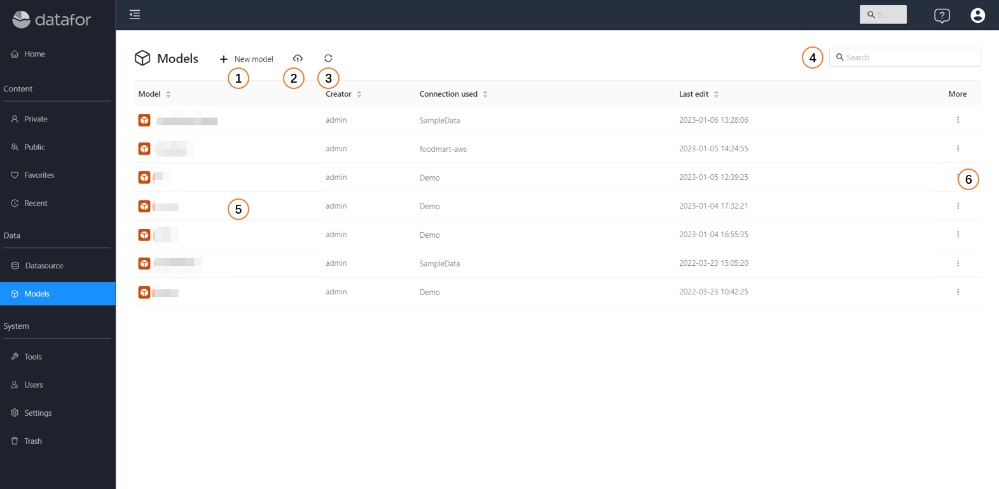
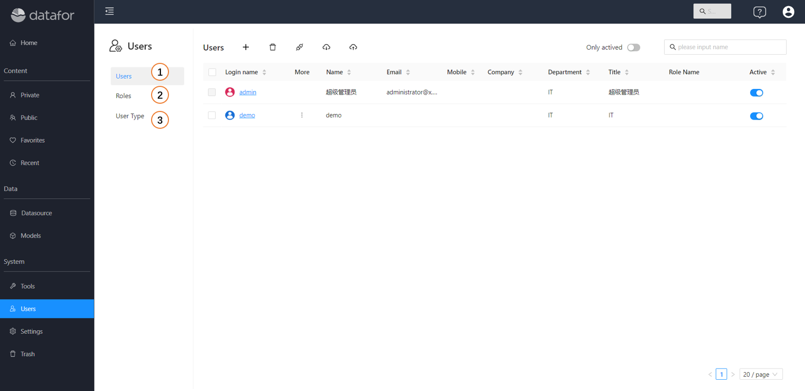
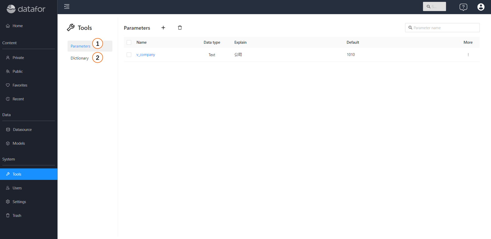
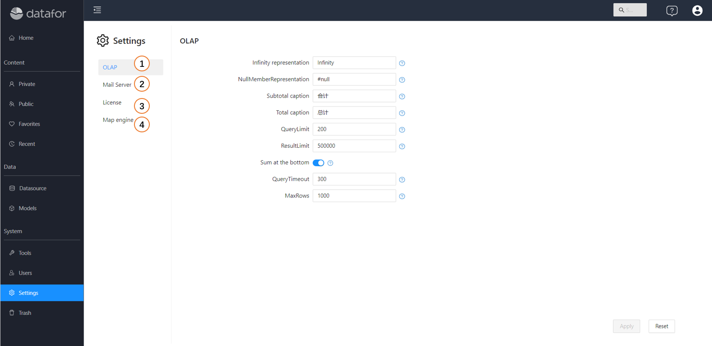

---
id: kzt-jmgnjs
title: Console
sidebar_position: 1
---
# Console

Datafor Console is the web-based management interface for the Datafor data visualization and analysis platform. It provides administrators and users with tools to manage, monitor, and configure Datafor services, analytical reports, data sources, analysis models, and more.

## Key Features

- **Analytical Reports**: Navigate the analytical reports directory structure, manage access permissions, favorites, recent access lists, downloads, and uploads.
- **Data Sources**: Configure and manage data sources for reporting and analysis.
- **Analysis Models**: Configure and manage analysis models.
- **Tools**: Manage system plugins.
- **Users**: Manage users and roles.
- **Settings**: Server settings, configure plugins, and manage system preferences.

## Accessing Datafor Console

1. **Login**: Open your web browser and navigate to the Datafor Console URL provided by your administrator. Enter your credentials to log in.
2. **Homepage**: Upon logging in, you will be directed to the console page.

1. **Homepage**: On the homepage, you can see the sample page, recently created page and DATAFOR profile entry.
2. **My**: Store and manage private directories and files. The contents in this folder are only visible to the logged-in user, and not to other users.
3. **Public**: Store and manage public directories and files. The content in this folder can be set with different permissions for different users and roles.
4. **Favorites**: store and manage favorite files.
5. **Recent Access**: store recently accessed files.
6. **Data Connection**: Manage data sources, including database and file data sources.
7. **Analysis Model**: Manage multidimensional analysis models.
8. **User**: Manage users and roles.
9. **Parameter Management**: Manage global parameters.
10. **Settings**: System-level settings.
11. **Trash Bin**: Deleted files and folder contents.
12. **Search**: global search, including: files, folders, analysis models, data connections.
13. **Help**: Jump to the help website.
14. **Logout**: Log out of the system.
15. **My Account**: My account management and personalization settings.

## Private

The "**Private**" folder is used to store private directories and files, and the content in this folder cannot be authorized to be accessed by others.

1. **Directory Navigation**: switch directory
2. **New**: Create a new folder or file
3. **Refresh**: Reload folder and file list content
4. **Upload**: upload files
5. **Download**: Download all folders and file contents under this folder
6. **Folder**: folder list
7. **Folder Operation Menu**: Rename, Delete, Download
8. **Search**: Search files
9. **File**: file list
10. **File operation menu**: edit, open new window, new window (no toolbar), rename, delete, download, copy, move
11. **Favorites**: add or remove from favorites

## Public

The directories and files in the "**Public**" folder can be accessed by different roles and users through authorization, and different permissions are granted.

1. **Directory Navigation**: switch directory
2. **New**: Create a new folder or file
3. **Refresh**: Reload folder and file list content
4. **Upload**: upload files
5. **Download**: Download all folders and file contents under this folder
6. **Folder**: folder list
7. **Folder Operation Menu**: Rename, Delete, Download, Permission, Copy Permission
8. **Search**: Search files
9. **File**: file list
10. **File Operation Menu**: Edit, New Window Open, New Window (no toolbar), Rename, Delete, Download, Copy, Move, Permissions, Copy Permissions
11. **Favorites**: add or remove from favorites

## Favorites

The "**Favorites**" folder stores files that you often need to access.

1. **Search**: Search files in favorites
2. **Favorite list**: list of favorite files
3. **Unfavorite**: remove the file from favorites

## Recent

A list of recently accessed files is stored in the "**Recent**" folder

1. **Recent**: list of recently accessed files
2. **Search**: Search for recently accessed files
3. **Favorites**: add or remove from favorites

## Datasource

"**Datasource**" is used to manage database connections and file datasets.

1. **Connections**: List of established database connections
2. **Data connection operation menu**: delete, create new analysis model
3. **Data source type list**: Data source types for available connections
4. **Search**: Search for established data connections

## Models

"**Models**", manage analysis models.

1. **New Model**: Create a new analysis model
2. **Upload**: Upload the analysis model
3. **Refresh**: Refresh the analysis model list
4. **Search**: Search analysis model
5. **Model List**: Analysis Model List
6. **More**: Analysis model operation menu, including: new file, rename, delete, copy, download, replace connection, permission setting, copy permission

## Users

Manage Users and Roles

1. **Users List**: Display and manage all users
2. **Roles List**: Display and manage all roles
3. **User Type**: Display and manage user types

## Tools

Parameter management, data dictionary management and other tools

1. **Parameter**: Management parameters
2. **Data Dictionary**: Manage data dictionary

## Settings

System settings related functions

1. **OLAP**: Multidimensional analysis engine settings
2. **Mail Server**: Mail Server Settings
3. **License**: License Management
2. **GIS map**: GIS map engine settings
