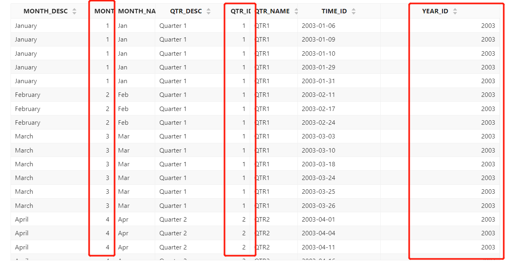

# Time dimension

Time is one of the most commonly used dimensions in data analysis. The time dimension may be a specific time dimension table, which stores field information such as time, date, year, month, etc., or it may be a time or date field in a certain business table. The analysis model of Datafor does not need to set a specific "time dimension", and any time field can be used as a "time dimension".

## Time field

1. ### Convert to time type

    Datafor will automatically recognize the "Timestamp" type field in the data table during the modeling process.

    If the data table does not store a "timestamp" type field, but you want to use it as a time field, then you can convert the field into a time type field on the model. Right-click the field or click the operation button on the right side of the field, and select the time type you want to convert from the pop-up menu.
    
   

2. ### Set the time field format

    Configure the date format in the Properties panel.

   

<!--Note: The date format must be consistent with the data format stored in the table. You can view the data format of the fields in the table by previewing the data.-->

## Time hierarchy (hierarchy)

What is the use of "time hierarchy"?

If the time stored in your data field is incomplete time information, such as: May, there is no year information, and the year information is stored in another field. Then you can make time-related queries by creating "time hierarchies". Datafor will automatically combine different levels of time information into time fields for query.

For example, your data table is like this, where the quarter and month have no year information, so they cannot be used as time fields for data query.

You can convert these three fields into time types respectively, and set the correct "date format", and create a "hierarchy".

