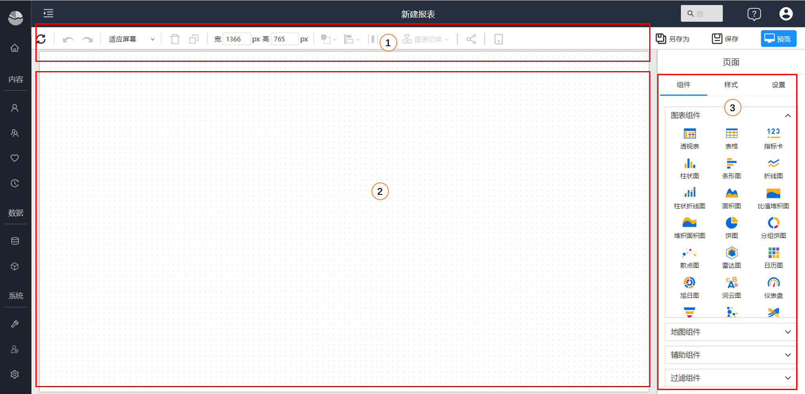
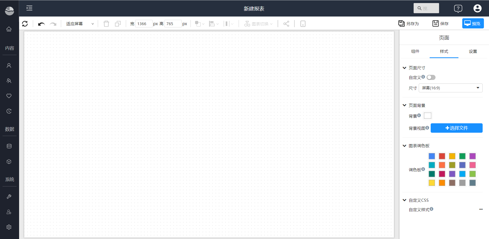
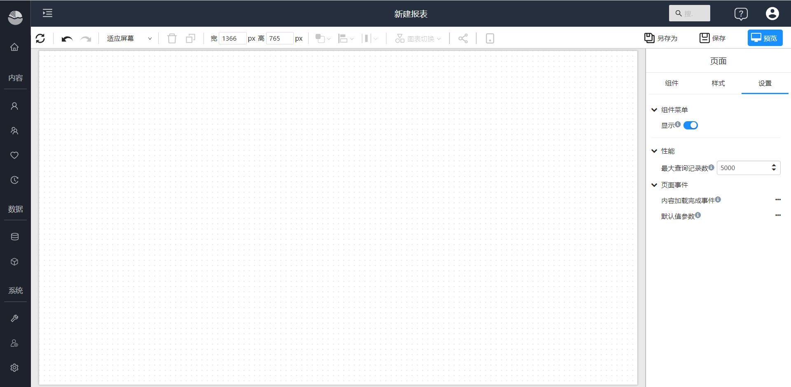
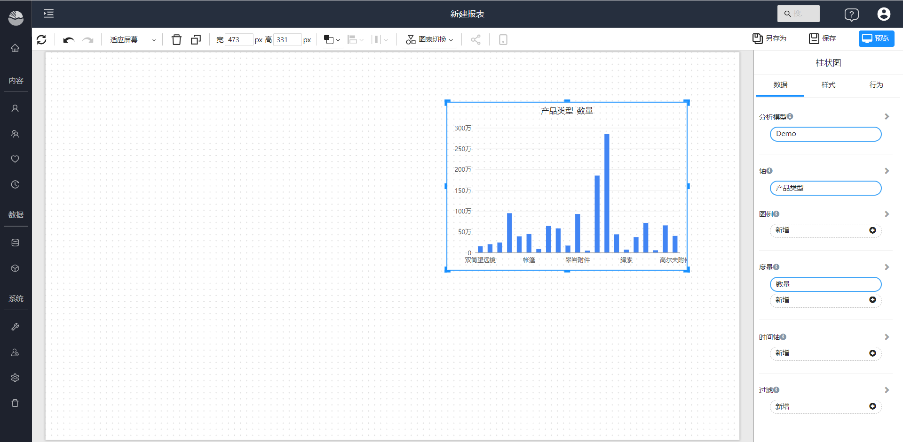
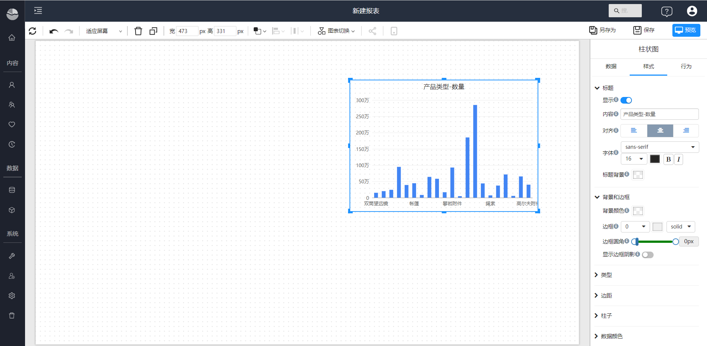
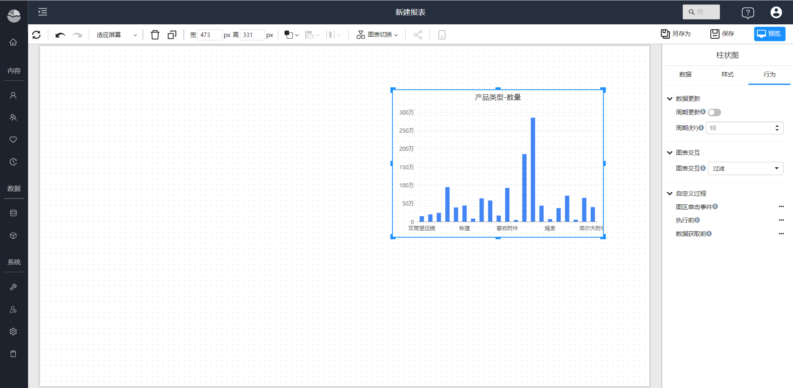

# Designer overview

You can use the analysis report designer to conduct exploratory analysis and make WYSIWYG data analysis reports by dragging and dropping.

1. Toolbar: common function area, including data refresh, rollback and forward, page layout, delete, copy, align, cascade, share and other functions.
2. Canvas area: In the creative area, you can adjust the size of the canvas, set the background, and place visual elements on the canvas.
3. Components and configuration area: This area toggles content based on the visual elements you select on the canvas. When no visual element is selected, you can select visual components and elements to add to the canvas, and configure page-level styles and behaviors. When components and elements on the canvas are selected, this area displays configuration items for that component.

## Page settings

The page setup content includes component selection, style, and settings.

- Style: page size, background, color palette and custom CSS etc.

  

- Settings: Control the component menu of all components on the page, set the maximum query records, custom define page events.

  

## Component settings

Component settings include component data configuration, data filtering, component style and component behavior.

- Data: set data and filters for the component.
  

- Style: set  the style of the component.

  

- Behavior: Set the interactive behavior of components, custom events, etc.

  

