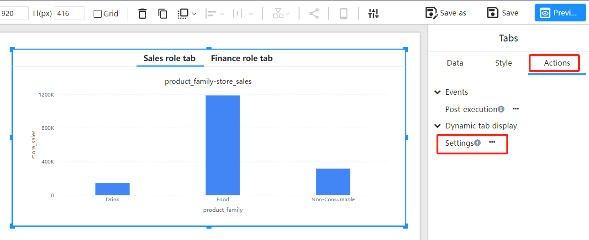
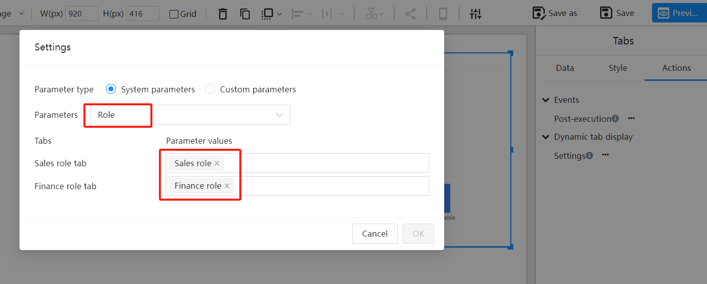
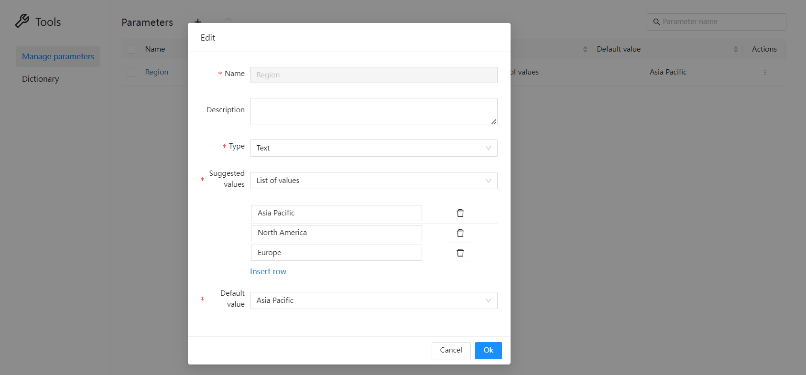
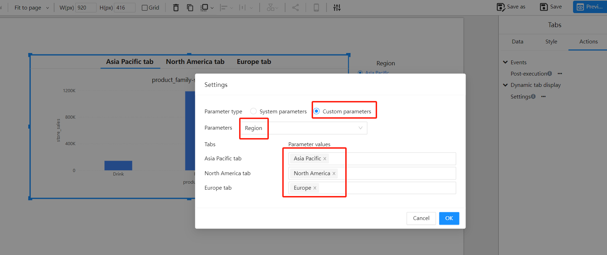
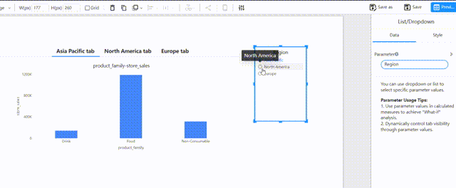
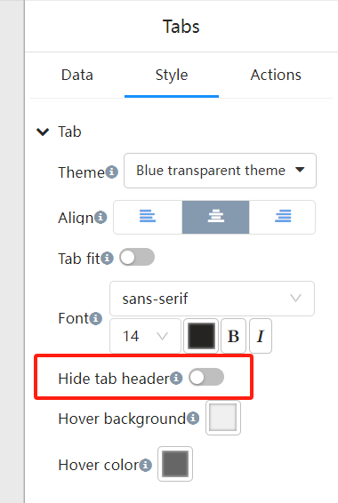
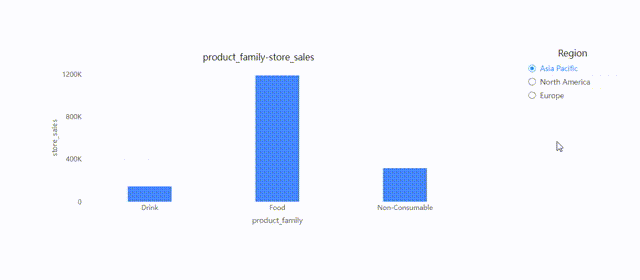

# Parameter-Driven Tab Switching

**Parameter-driven tab switching** allows dynamic control over the display of tabs based on system parameters or user-defined parameters.

## **Types of Parameters**

1. **System Parameters**

   - **User and Role-Based Visibility**: Tabs can be controlled based on the user's identity or role. For example, only users with specific roles can see certain tabs.

   - **Use Case**: A dashboard with different departments (e.g., Sales, Finance) where each department's tabs are visible only to users in that department.

2. **Global Parameters**

   - **User-Defined Parameters**: These parameters are set by users or administrators and determine which tabs are shown. The display of tabs dynamically changes based on user choices or specific conditions.
   - **Use Case**: Users can select a parameter (e.g., "Region") to control which tabs are displayed, such as tabs for different regions (e.g., APAC, North America, Europe).
   

## **Setting Up Parameter-Driven Tab Display**

### System Parameter-Driven:

- **Define User Roles**: Define user roles in the system settings.

- **Assign Roles to Tabs**: Configure which tabs are visible to each role.

  1. Select the tab component and choose "Settings" in the "Actions" panel.

     

  2. Choose the "Role" system parameter and set the corresponding role in the tab's parameter value.

     

### Global Parameter-Driven:

- **Create Parameters**: Define a global parameter called for example "Region".

     

- **Assign Parameter Values to Tabs**: Configure which tabs are visible based on the parameter values.

     

- **Use a Parameter Controller to Change Parameter Values**

     

## **Hiding the Tab Header**

In many cases, parameter-driven tab switching may require hiding the tab component's header.

   

The tab component's header can be hidden by setting the tab's style, allowing users to switch tabs only through parameter control, not manually.

 

