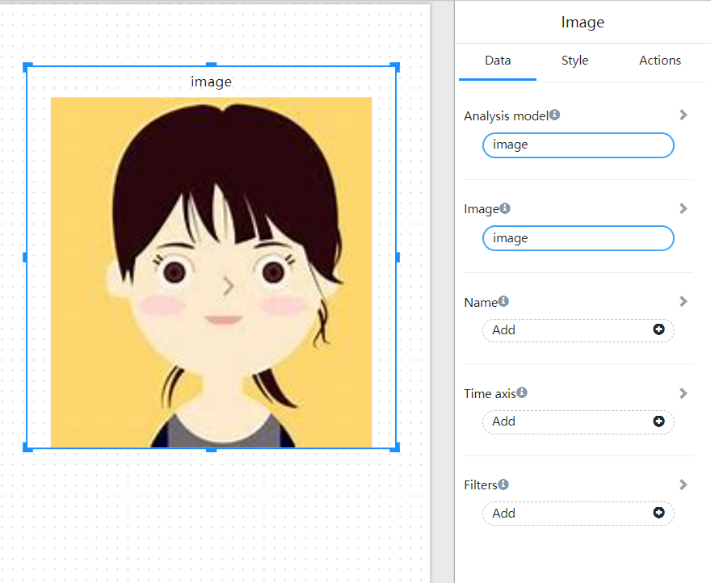

# Image

The Image component is used to display the Base64 encoding of the image or the hyperlink of the image.

## What is the Base64 encoding of pictures

The base64 encoding of a picture is to encode a piece of picture data into a string of strings, and use this string to replace the image address.

The following code is the base64 encoding of a picture:

```

```

## What is a hyperlink to an image

A hyperlink image is a hyperlink pointing to an image.

For example: https://datafor.com.cn/wp-content/uploads/2020/01/Datafor-logo-2.png

## Use Image component

You can store the base64 encoding or hyperlink of the picture in the database, and then you can use the Datafor model to reference and display the picture in the picture component.

<div align="left"></div>
