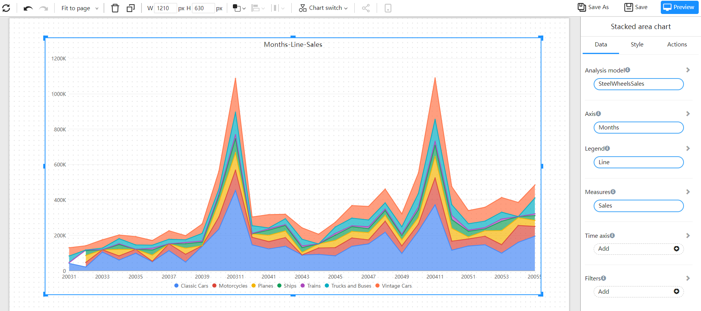

# Stacked area

A stacked area chart is used to display the relative changes of multiple sets of data over different time periods. This type of graph stacks the values of multiple sets of data to create a cumulative area chart. Each set of data is drawn as a line and overlaps with the next set of data, creating an accumulated effect. This clearly shows the overall composition of the data and the relative contribution of each set of data. The X-axis usually represents time, while the Y-axis represents values. Stacked area charts are commonly used to analyze the relative amount and overall changes of multiple sets of data, such as the change in market share in an industry or the allocation of expenses in a budget.

## Applicable scenario

- Market share analysis: Show the market share changes of multiple companies within an industry through a graph.
- Cost allocation: Used to display the allocation of expenses in a budget.
- Resource utilization: Used to display the utilization of multiple resources in a project.
- Time series data: Used to show changes in multiple indicators over a period of time.
- Multi-dimensional data analysis: Used to display the relationship of multi-dimensional data.

## Composition

1. X-axis: Represents the time interval, usually a continuous sequence of data points.
2. Y-axis: Represents the value or magnitude of the data points.
3. Stacked area: The overlapping areas formed by multiple data series, stacked one on top of the other, represent the cumulative values of each data series.
## Example

## Settings

| Items | Reference Documents |
| -------------- | -------- |
| Background and border | |
| Legend | |
| | |