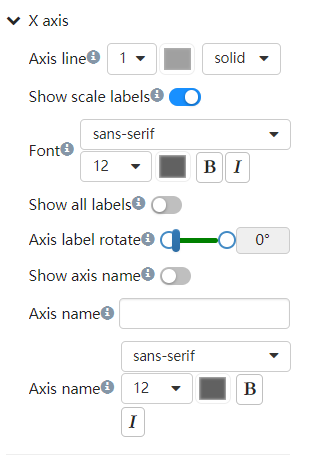
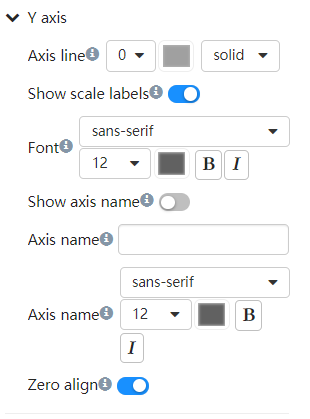

# Customize the X and Y axes

Not all chart components have axes, for example, pie charts do not have axes. The customization options for X-axis and Y-axis of components with coordinate axes may not be exactly the same. Here we take the histogram as an example to introduce some common options.

## X axis

1. Expand the X-Axis Styles tab

   
 

2. Line

   Adjust line thickness, line color, line style.

3. Scale text

    Whether to display positive text, set the text font, color, whether it is bold, whether italic.
    It is often necessary to rotate the scale text when the distance between the columns is too small and the display position of the scale text is not enough.

4. Axis name

    Axis names are displayed to the right of the X-axis. Text can be custom entered. At the same time, you can set text properties such as font and color of the text.

## Y axis

1. Expand the Y-Axis Styles tab

   
 

2. Line

    Adjust line thickness, line color, line style.

3. Scale labels

    Whether to display positive text, set the text font, color, whether it is bold, whether italic.
    It is often necessary to rotate the scale text when the distance between the columns is too small and the display position of the scale text is not enough.

4. Axis name

    Axis name are displayed to the right of the X-axis. Text can be custom entered. At the same time, you can set text properties such as font and color of the text.

5. Zero align

    Sets whether the range of the axis starts at min/zero.
