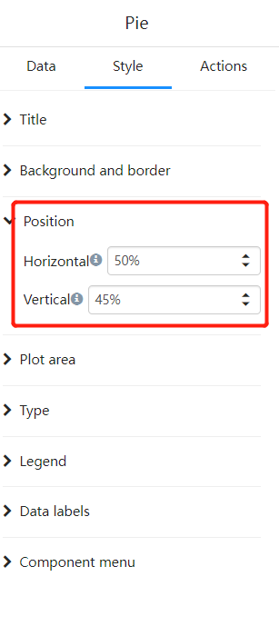
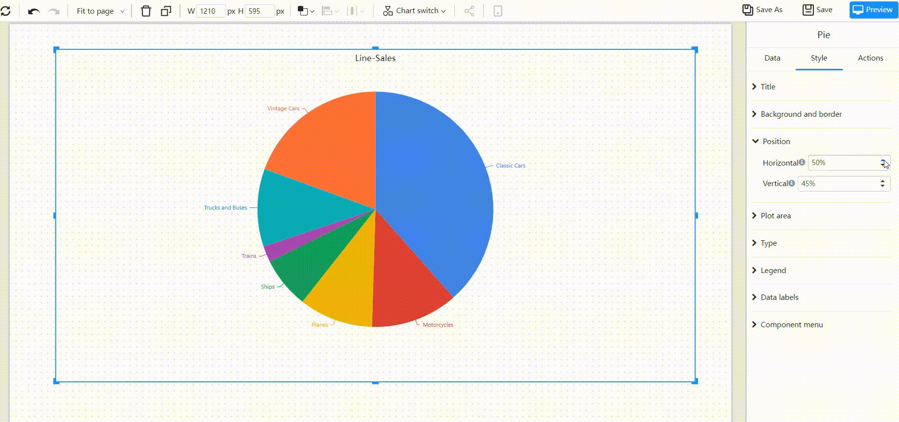
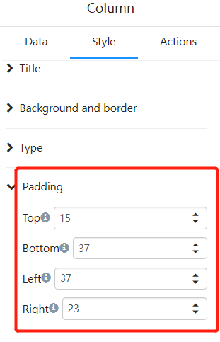
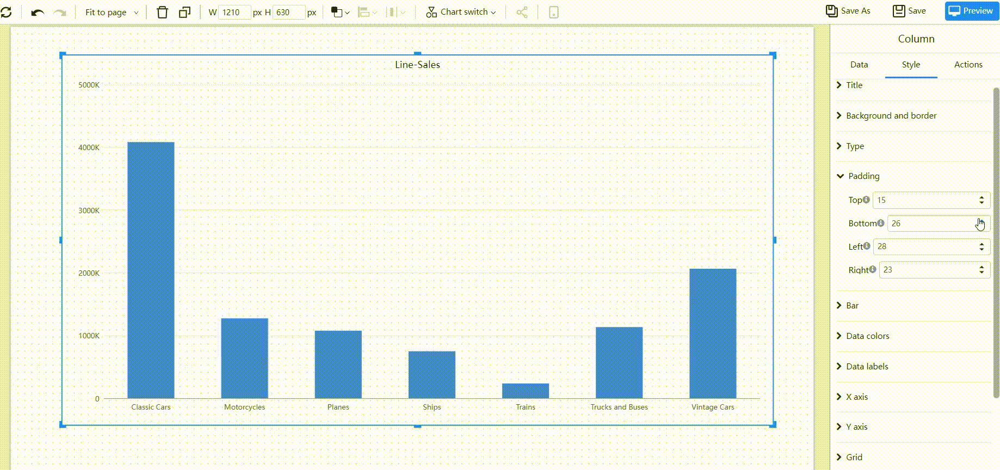

# Component position and margins

Sometimes the default rendering position or margin of the component cannot meet the layout requirements and needs to be further adjusted.

## Position 

Expand the Positions tab in the Styles panel

 

Adjust the plot position of the component by adjusting the "Horizontal" and "Vertical" percentages.

The percentage of position is the ratio of the center position of the value plot area to the margin.

 

## Margins

Expand the padding tab in the Styles panel

 

Adjust the spacing between plots and component borders.

 

