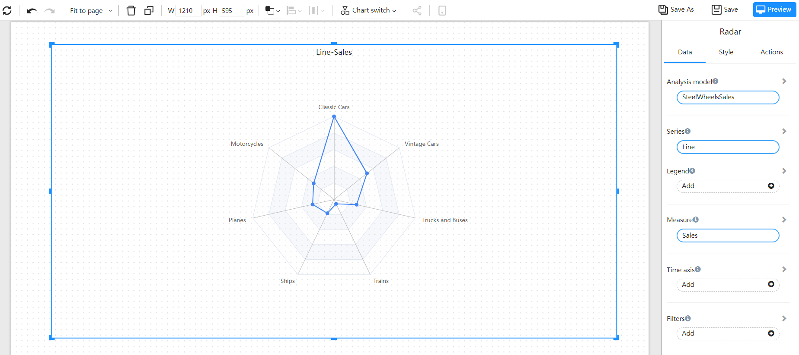
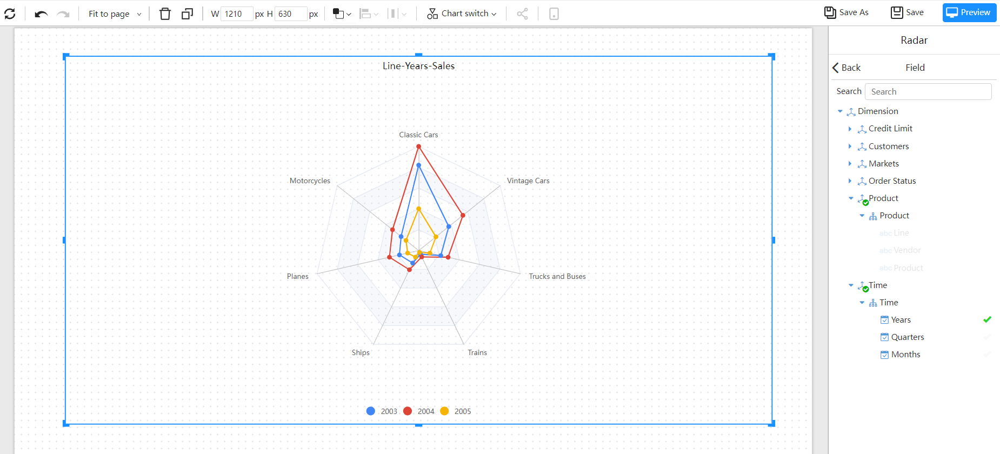
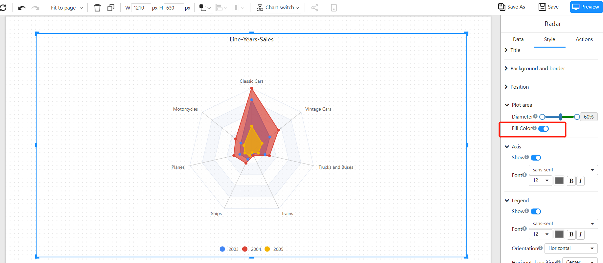

# Radar

A radar chart is a graph that converts data of 3 or more different dimensions into a unified measurement through a certain formula, and draws them on the same central point starting axis. The radar chart can display the data of multiple dimensions of the object, and convert the dimensional data of different measures into a unified measure, which intuitively describes the attributes of a single object.

The radar chart consists of two parts: multiple dimensions and unified measurement.

## Applicable scene

- The radar chart is suitable for multi-dimensional data (more than four dimensions), and is generally used to represent the comprehensive situation of a certain data field, and there are generally about 6 data points.

## composition

1. The data of each **dimension** corresponds to a **coordinate axis** respectively. These coordinate axes have the same center of circle, are arranged radially at the same interval, and **the scales of each coordinate axis are the same* *.
2. The grid lines connecting the axes are usually only auxiliary elements.
3. Connect the **data points on each axis with a line** to form a **polygon**.
4. Coordinate axes, points, lines, and polygons together form a radar chart.

## Example

### Single radar chain

****

### Multi-radar chain

Usually represents a measure of capability that consists of multiple dimensions.

### Populate the radar chart

