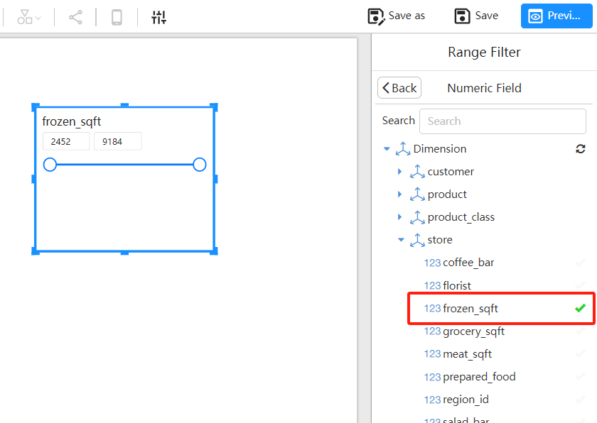

# Number Range Filter

The Number Range Filter is used to filter numerical fields in the dimension of an analysis model.

## Numerical Dimension Fields

Only numerical dimension fields can be used in the Number Range Filter.

### **Datafor Analysis Model**

When creating an analysis model in Datafor, the system automatically detects the field types in the data table and sets the dimension fields of the analysis model to "numerical."

### **Pentaho Mondrian 3 Schema**

In Pentaho’s schema file, fields with the type set to "Numeric."

## How to Add a Number Range Filter?

The following steps will guide users on how to add and configure a Number Range Filter in a Datafor report:

1. **Select the Number Range Filter**

1. **Select a “Numerical” Field**

   > [!NOTE]
   >
   > When selecting a field for the Number Range Filter, only “numerical” fields will be displayed in the model.

## Using the Number Slicer

### Adjusting the Range

1. In the report view, users will see a slicer with two sliders representing the minimum and maximum values.
2. Users can adjust the filter range by dragging the sliders, e.g., from 100 to 500.
3. Like other filter components, the slicer will automatically update other chart components subscribed to this filter component in the report, displaying only data that falls within the selected range.

### Entering Specific Values

1. Users can also directly enter the specific minimum and maximum values in the text boxes next to the slicer.
2. After entering the values, press Enter, and the slicer will update the filter range according to the entered values.

## Summary

The Number Range Filter allows users to filter numerical data more flexibly, enabling quick focus on data segments within a specific numerical range.