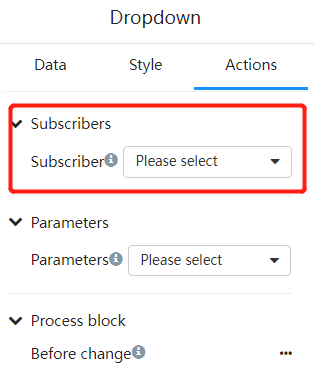
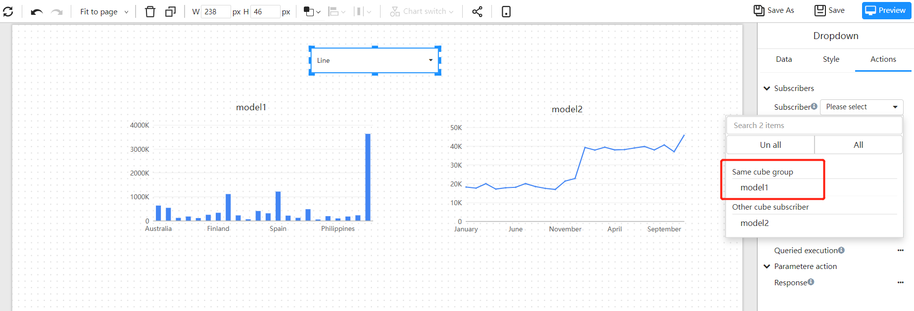
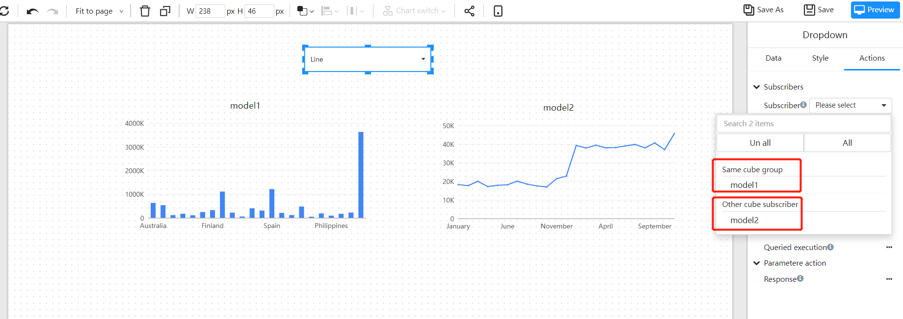
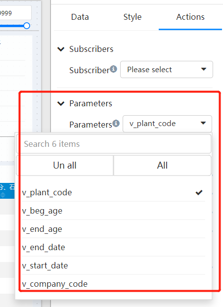

# Subscriptions for filter component

There is a "subscription" configuration item in the behavior panel of each Datafor filter component. "Subscription" is to establish a data filtering relationship between the filtering component and other components. The filter component passes the filter value to the subscriber component.

## Why is there a "subscription"

In some scenarios, the filter component's value is not passed to all data components. For example, a "summary" value needs to be displayed on the page all the time, and this value does not need to change with the value of the filter component. In this scenario, there is no need to establish a "subscription" relationship between the "summary" value component and the filter component.

## Use the same analysis model components subscription
If the filter component and the chart component use the same analysis model, then the component will appear in the subscription list.

## Component subscription across models

When the data of multiple components on the page comes from different analysis models, if the analysis models have the same dimension and dimension field, the filter component can pass the filter value to different models.

## Subscriptions between filter components

- When two filter components refer to fields of the same dimension or level, a subscription relationship can be established between the two filter components.

- When two filter components refer to fields of different dimensions, subscribers need to turn on the "Join fact table" switch.

## Create a subscription with parameters

Filter components can pass filter values to parameters. If this parameter is used in the analysis model of other components in the page, then this component can subscribe to this filter component.

