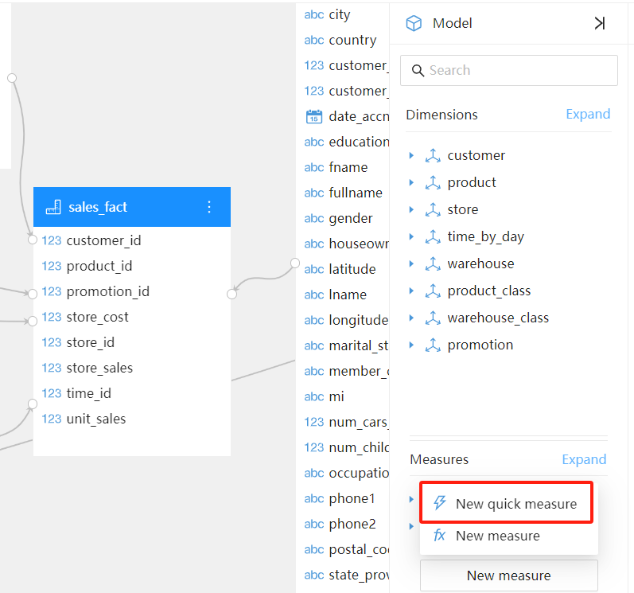
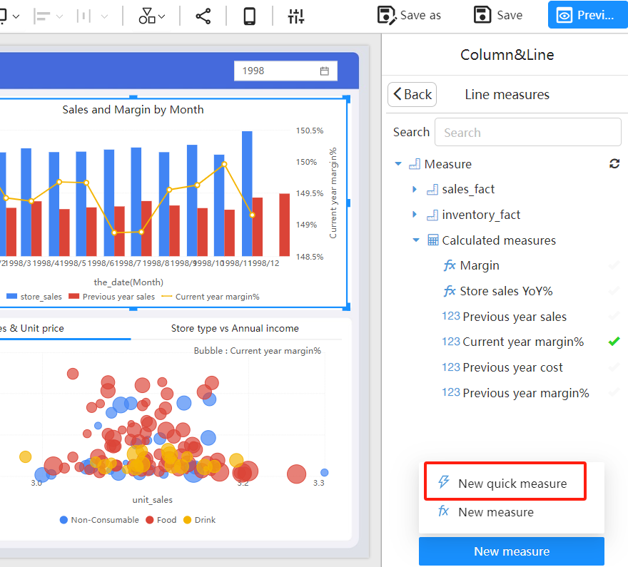
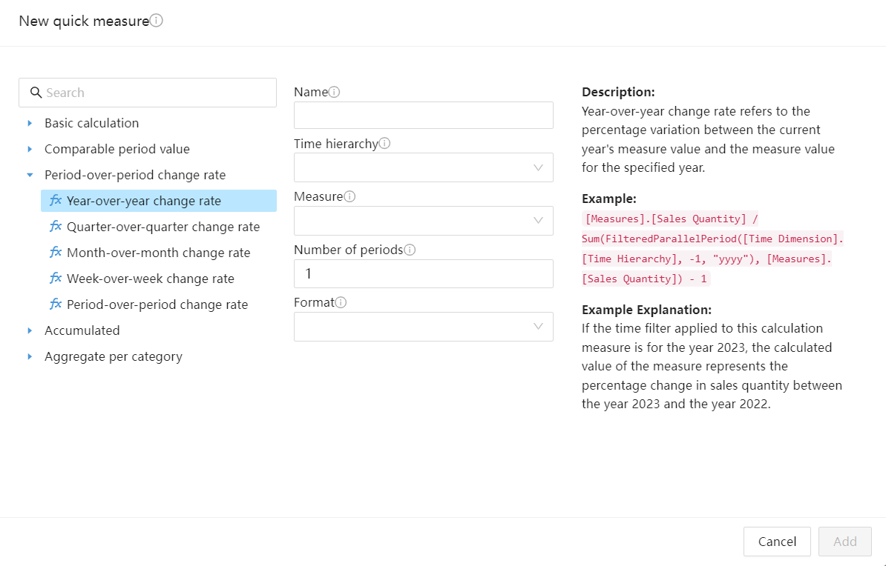
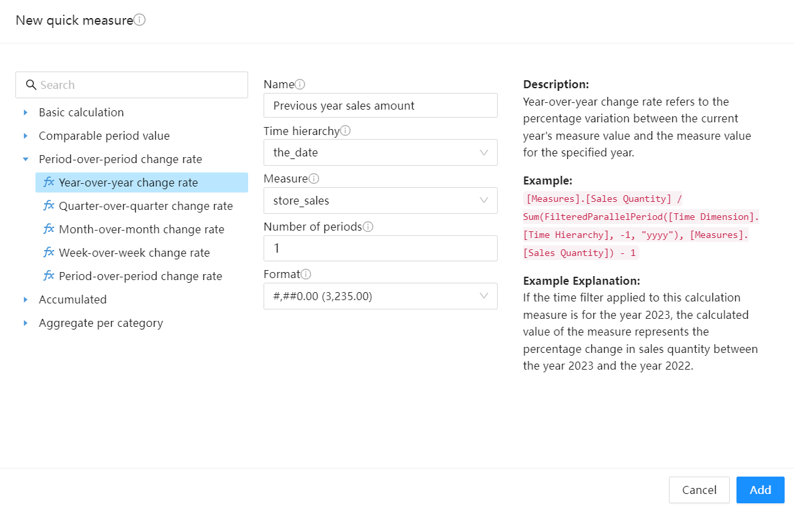
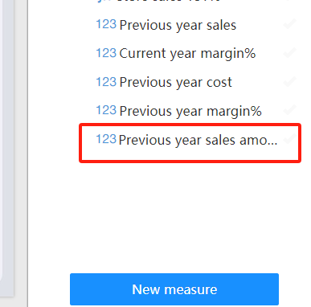
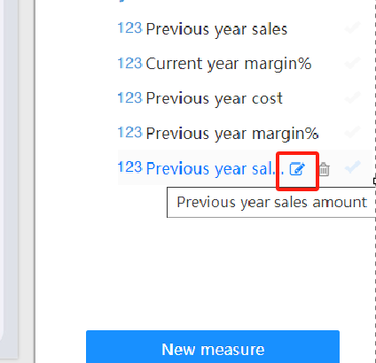
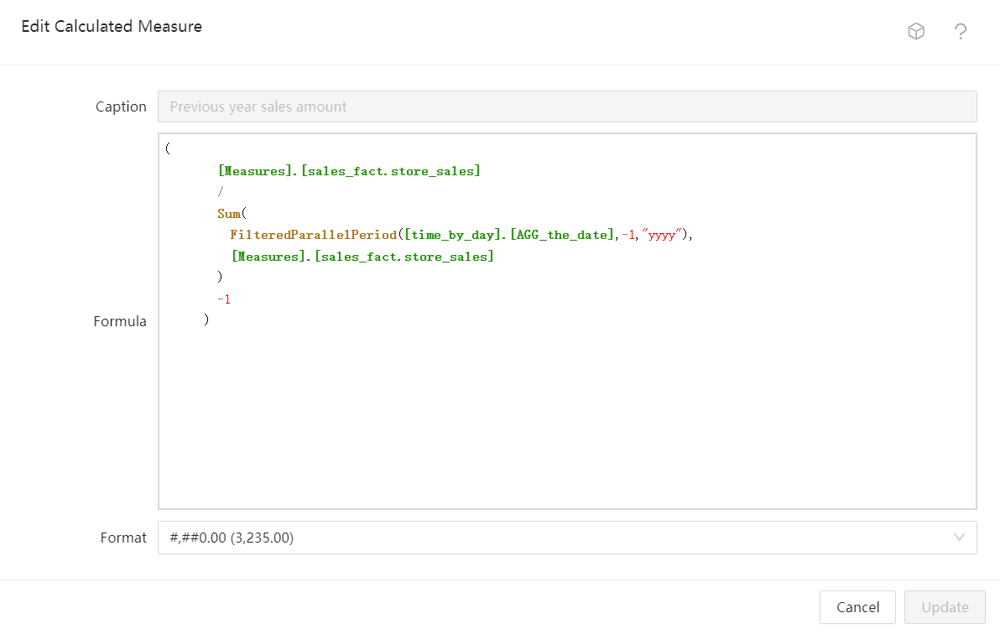

# Quick Calculated Measures

## Overview

Datafor's Quick Calculated Measures feature allows users to quickly create various common measures through a simplified interface and predefined calculation logic. This is especially useful for users who are not familiar with MDX (Multidimensional Expressions) syntax. Quick Calculated Measures include sums, year-to-date totals, year-over-year comparisons, month-over-month comparisons, and other common business needs.

## Advantages of Quick Calculated Measures

- **Simplified Calculation Process**: No need to write complex MDX formulas; common measures can be quickly created through a graphical interface.
- **Increased Efficiency**: The Quick Calculated Measures feature speeds up the process of creating measures, especially for common business needs.
- **Easy to Understand**: Previewing and auto-generating formulas help users understand the calculation logic, enhancing data analysis skills.

## When to Create Quick Calculated Measures

1. **When Creating or Editing an Analysis Model**

   When creating or editing an analysis model, click the "New Measure" button and select "New quick measure."

   

2. **When Creating Analysis Reports**

   During the process of adding a "Measure" field to a chart, click the "New Measure" button and select "New Quick Measure."

   **Note: Calculated measures created on analysis reports are only visible within that specific report.**

   

## Steps to Create Quick Calculated Measures

1. **Select Calculation Type**: In the pop-up Quick Calculated Measures window, you can see various predefined calculation types such as sum, subtraction, year-over-year value, month-over-month value, etc. Select the calculation type you need.

   

2. **Configure Parameters**: Fill in the required parameters according to the selected calculation type. For example, for a "year-over-year value" calculation, select the time field, measure, and the difference between the comparison year and the current year.

   

3. **Add Calculated Measure**: At the bottom of the window, click the "Add" button. The created calculated measure will be added to the model.

   

4. **View Formula**: Click the edit button of the calculated measure. This helps you understand the underlying calculation logic.

   

5. **Modify Calculated Measure**: If needed, you can modify the formula of the calculated measure and update the created Quick Measure.

   

By following this document, you should be able to easily get started with Datafor's Quick Calculated Measures feature, enhancing your data analysis efficiency and accuracy.