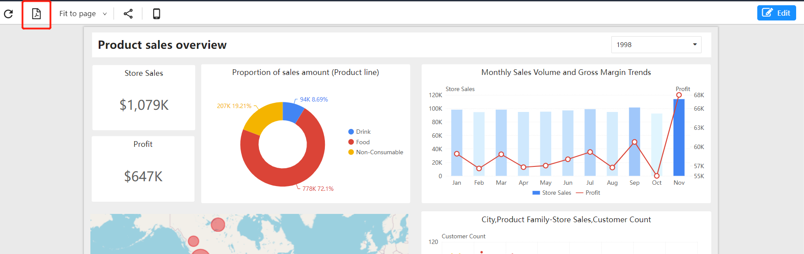
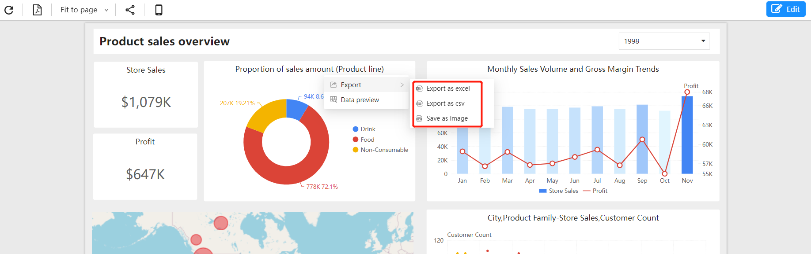

# Export

Datafor provides various export formats, allowing users to export data and reports in different ways.

- PDF: Save reports in PDF format, providing high-quality printing and sharing capabilities.
- Excel: Export data in spreadsheet format, allowing users to perform more detailed analysis and processing of the data.
- CSV: Export data in comma-separated values format. This format is suitable for importing data into other software, such as databases or spreadsheets.
- PNG: Export reports in image format, making it easy to insert them into documents, presentations or web pages.

## Report Export

Export reports as PDF files using the export button on the toolbar.

## Component Export

Export components via the "Component Menu":

1. Image files
2. Excel files
3. CSV files

